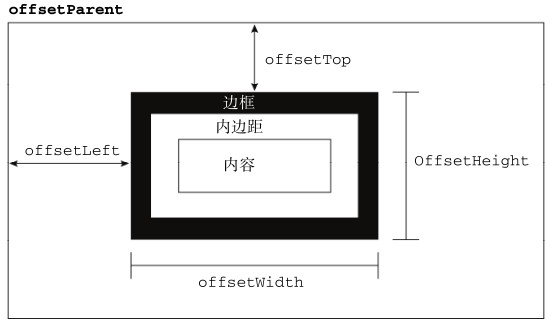
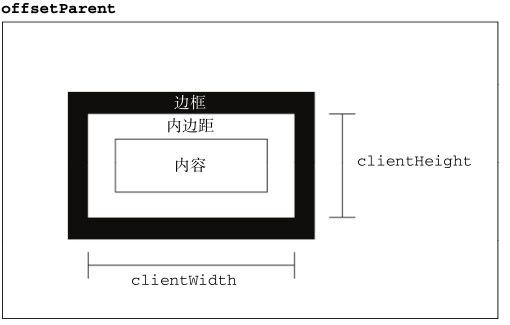
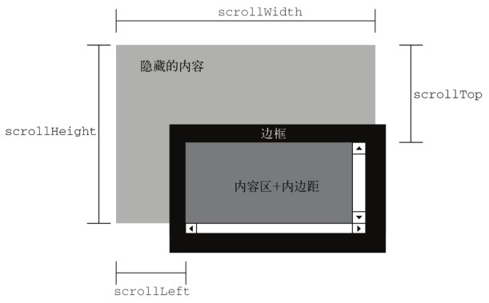

# DOM

全称：**document object model**文档对象模型。是一组针对HTML和XML文档的API。

## DOM一级

### Node对象

​	DOM1 级定义了一个 Node 接口，该接口将由 DOM 中的所有节点类型实现。这个 Node 接口在JavaScript 中是作为 Node 类型实现的；除了 IE 之外，在其他所有浏览器中都可以访问到这个类型。JavaScript 中的所有节点类型都继承自 Node 类型，因此所有节点类型都共享着相同的基本属性和方法。

​	每个节点都有一个 nodeType 属性，用于表明节点的类型。节点类型由在 Node 类型中定义的下列12 个数值常量来表示，任何节点类型必居其一:

- Node.ELEMENT_NODE (1)；

- Node.ATTRIBUTE_NODE (2)；

- Node.TEXT_NODE (3)；

- Node.CDATA_SECTION_NODE (4)；

- Node.ENTITY_REFERENCE_NODE (5)；

- Node.ENTITY_NODE (6)；

- Node.PROCESSING_INSTRUCTION_NODE (7)；

- Node.COMMENT_NODE (8)；

- Node.DOCUMENT_NODE (9)；

- Node.DOCUMENT_TYPE_NODE (10)；

- Node.DOCUMENT_FRAGMENT_NODE (11)；

- Node.NOTATION_NODE (12)。

   通过比较上面这些常量，可以很容易地确定节点的类型，例如：

   ```javascript
   if (someNode.nodeType == Node.ELEMENT_NODE){ //在 IE 中无效
    	       alert("Node is an element.");
   }
   ```
   由于 IE 没有公开 Node 类型的构造函数，因此上面的代码在 IE 中会导致错误。为了确保跨浏览器兼容，最好还是将 nodeType 属性与数字值进行比较，如下所示：

   ```javascript
   if (someNode.nodeType == 1){ // 适用于所有浏览器
    	       alert("Node is an element.");
   }
   ```

   开发人员最常用的就是元素和文本节点。

#### nodeName**和 **nodeValue 属性

要了解节点的具体信息，可以使用 nodeName 和 nodeValue 这两个属性。这两个属性的值完全取
决于节点的类型。在使用这两个值以前，最好是像下面这样先检测一下节点的类型。

```javascript
if (someNode.nodeType == 1){  // 先检查是否是元素类型
 	   value = someNode.nodeName; //nodeName 的值是元素的标签名
}
```

#### 节点关系

​	文档中所有的节点之间都存在这样或那样的关系。节点间的各种关系可以用传统的家族关系来描述，相当于把文档树比喻成家谱。在 HTML 中，可以将` <body> `元素看成是` <html> `元素的子元素；相应地，也就可以将` <html> `元素看成是 `<body> `元素的父元素。而` <head> `元素，则可以看成是 `<body> `元素的同胞元素，因为它们都是同一个父元素` <html> `的直接子元素。

​	每个节点都有一个` childNodes `属性，其中保存着一个 `NodeList `对象。 `NodeList `是一种类数组对象，用于保存一组有序的节点，可以通过位置来访问这些节点。请注意，虽然可以通过方括号语法来访问` NodeList `的值，而且这个对象也有 `length` 属性，但它并不是` Array `的实例。 `NodeList` 对象的独特之处在于，它实际上是基于` DOM `结构动态执行查询的结果，因此` DOM` 结构的变化能够自动反映在` NodeList` 对象中。我们常说，` NodeList `是有生命、有呼吸的对象，而不是在我们第一次访问它们的某个瞬间拍摄下来的一张快照。

```javascript
var firstChild = someNode.childNodes[0];  // 可以使用数组方式
var secondChild = someNode.childNodes.item(1);  // 也可以使item
var count = someNode.childNodes.length;
```

​	每个节点都有一个` parentNode `属性，该属性指向文档树中的父节点。包含在 `childNodes `列表中
的所有节点都具有相同的父节点，因此它们的 `parentNode `属性都指向同一个节点。此外，包含在`childNodes` 列表中的每个节点相互之间都是同胞节点。通过使用列表中每个节点`previousSibling`
和 `nextSibling `属性，可以访问同一列表中的其他节点。列表中第一个节点的 `previousSibling `属性值为`null `，而列表中最后一个节点的 `nextSibling` 属性的值同样也为 `null` ，如下面的例子所示：

```javascript
if (someNode.nextSibling === null){
 	   alert("Last node in the parent’s childNodes list.");
} else if (someNode.previousSibling === null){
 	   alert("First node in the parent’s childNodes list.");
}
```

​	父节点与其第一个和最后一个子节点之间也存在特殊关系。父节点的 `firstChild `和 `lastChild`属性分别指向其 `childNodes `列表中的第一个和最后一个节点。其中， `someNode.firstChild `的值始 终 等 于 `someNode.childNodes[0] `， 而 `someNode.lastChild `的 值 始 终 等 于 `someNode.childNodes [someNode.childNodes.length-1] `。在只有一个子节点的情况下， `firstChild `和`lastChild` 指向同一个节点。如果没有子节点，那么 `firstChild` 和` lastChild` 的值均为` null` 。明确这些关系能够对我们查找和访问文档结构中的节点提供极大的便利。


#### 操作节点

​	因为关系指针都是只读的，所以 DOM 提供了一些操作节点的方法。其中，最常用的方法是`appendChild()` ，用于向 `childNodes `列表的末尾添加一个节点。添加节点后，` childNodes` 的新增节点、父节点及以前的最后一个子节点的关系指针都会相应地得到更新。更新完成后， `appendChild()`返回新增的节点。来看下面的例子：

```javascript
var returnedNode = someNode.appendChild(newNode);
alert(returnedNode == newNode); //true
alert(someNode.lastChild == newNode); //true
```

​	如果需要把节点放在 childNodes 列表中某个特定的位置上，而不是放在末尾，那么可以使用`insertBefore() `方法。这个方法接受两个参数：要插入的节点和作为参照的节点。插入节点后，被插
入的节点会变成参照节点的前一个同胞节点`（ previousSibling ）`，同时被方法返回。如果参照节点是`null `，则 `insertBefore() `与` appendChild() `执行相同的操作，如下面的例子所示。

```javascript
//插入后成为最后一个子节点
returnedNode = someNode.insertBefore(newNode, null);
alert(newNode == someNode.lastChild); //true
//插入后成为第一个子节点
var returnedNode = someNode.insertBefore(newNode, someNode.firstChild);
alert(returnedNode == newNode); //true
alert(newNode == someNode.firstChild); //true
//插入到最后一个子节点前面
returnedNode = someNode.insertBefore(newNode, someNode.lastChild);
alert(newNode == someNode.childNodes[someNode.childNodes.length-2]); //true
```

​	前面介绍的` appendChild() `和` insertBefore() `方法都只插入节点，不会移除节点。而下面要介绍的` replaceChild() `方法接受的两个参数是：要插入的节点和要替换的节点。要替换的节点将由这个方法返回并从文档树中被移除，同时由要插入的节点占据其位置。来看下面的例子。

```javascript
//替换第一个子节点
var returnedNode = someNode.replaceChild(newNode, someNode.firstChild);
//替换最后一个子节点
returnedNode = someNode.replaceChild(newNode, someNode.lastChild);
```

​	在使用 `replaceChild() `插入一个节点时，该节点的所有关系指针都会从被它替换的节点复制过
来。尽管从技术上讲，被替换的节点仍然还在文档中，但它在文档中已经没有了自己的位置。
​	如果只想移除而非替换节点，可以使用 `removeChild() `方法。这个方法接受一个参数，即要移除
的节点。被移除的节点将成为方法的返回值，如下面的例子所示。

```javascript
//移除第一个子节点
var formerFirstChild = someNode.removeChild(someNode.firstChild);
//移除最后一个子节点
var formerLastChild = someNode.removeChild(someNode.lastChild);
```

#### 其他方法

​	有两个方法是所有类型的节点都有的。第一个就是 cloneNode() ，用于创建调用这个方法的节点
的一个完全相同的副本。` cloneNode()` 方法接受一个布尔值参数，表示是否执行深复制。在参数为` true`的情况下，执行深复制，也就是复制节点及其整个子节点树；在参数为` false` 的情况下，执行浅复制，即只复制节点本身。复制后返回的节点副本属于文档所有，但并没有为它指定父节点。

​	最后一个方法是` normalize() `，这个方法唯一的作用就是处理文档树中的文本节点。由于解析器的实现或` DOM `操作等原因，可能会出现文本节点不包含文本，或者接连出现两个文本节点的情况。当在某个节点上调用这个方法时，就会在该节点的后代节点中查找上述两种情况。如果找到了空文本节点，则删除它；如果找到相邻的文本节点，则将它们合并为一个文本节点。

### Document类型

​	`JavaScript` 通过` Document` 类型表示文档。在浏览器中， `document `对象是` HTMLDocument `（继承
自 `Document` 类型）的一个实例，表示整个 HTML 页面。而且，` document `对象是 `window `对象的一个
属性，因此可以将其作为全局对象来访问。 `Document `节点具有下列特征：

- nodeType 的值为 9；
- nodeName 的值为 "#document" ；
- nodeValue 的值为 null ；
- parentNode 的值为 null ；
- ownerDocument 的值为 null ；
- 其子节点可能是一个 DocumentType （最多一个）、 Element （最多一个）、 ProcessingInstruction或 Comment 。

#### 文档的子节点

​	虽然 DOM 标准规定 Document 节点的子节点可以是 DocumentType 、 Element 、 ProcessingInstruction 或 Comment ，但还有两个内置的访问其子节点的快捷方式。第一个就是 documentElement属性，该属性始终指向 HTML 页面中的 `<html> `元素。另一个就是通过 childNodes 列表访问文档元素，但通过 documentElement 属性则能更快捷、更直接地访问该元素。

```html
<html>
  <body>
  </body>
</html>
```

```javascript
var html = document.documentElement; //取得对<html>的引用

// 下面这两行代码在第一行不是html元素时不成立，可能是注释(Comment)或者<!doctype html>(DocumenType)
alert(html === document.childNodes[0]); //true
alert(html === document.firstChild); //true
```

​	作为 HTMLDocument 的实例， document 对象还有一个 body 属性，直接指向` <body> `元素。因为开发人员经常要使用这个元素，所以 document.body 在 JavaScript代码中出现的频率非常高，其用法如下。

```javascript
var body = document.body; //取得对<body>的引用
```

​	所有浏览器都支持 document.documentElement 和 document.body 属性。
​	Document 另一个可能的子节点是 DocumentType 。通常将 <!DOCTYPE> 标签看成一个与文档其他
部分不同的实体，可以通过 doctype 属性（在浏览器中是 document.doctype ）来访问它的信息。

```javascript
var doctype = document.doctype; //取得对<!DOCTYPE>的引用
```

浏览器对 document.doctype 的支持差别很大，可以给出如下总结。

- IE8 及之前版本：如果存在文档类型声明，会将其错误地解释为一个注释并把它当作 Comment节点；而 document.doctype 的值始终为 null 。
- IE9+及 Firefox：如果存在文档类型声明，则将其作为文档的第一个子节点； document.doctype
  是一个 DocumentType 节点，也可以通过 document.firstChild 或 document.childNodes[0]访问同一个节点。
- Safari、Chrome和 Opera：如果存在文档类型声明，则将其解析，但不作为文档的子节点。 document.doctype 是一个 DocumentType 节点，但该节点不会出现在 document.childNodes中。

#### 文档信息

​	作为 HTMLDocument 的一个实例， document 对象还有一些标准的 Document 对象所没有的属性。这些属性提供了 document 对象所表现的网页的一些信息。其中第一个属性就是 title ，包含`<title>` 元素中的文本——显示在浏览器窗口的标题栏或标签页上。通过这个属性可以取得当前页面的标题，也可以修改当前页面的标题并反映在浏览器的标题栏中。修改` title `属性的值不会改变 `<title>`元素。

```javascript
//取得文档标题
var originalTitle = document.title;
//设置文档标题
document.title = "New page title";
//取得完整的 URL
var url = document.URL;
//取得域名
var domain = document.domain;
//取得来源页面的 URL
var referrer = document.referrer;
```

​	在这 3 个属性中(url, domain, referrer)，只有 domain 是可以设置的。但由于安全方面的限制，也并非可以给 domain 设置任何值。如果 URL 中包含一个子域名，例如 p2p.wrox.com，那么就只能将 domain 设置为"wrox.com"（URL 中包含 "www" ，如 www.wrox.com 时，也是如此）。**不能将这个属性设置为 URL 中不包含的域**，如下面的例子所示。

```javascript
//假设页面来自 p2p.wrox.com 域
document.domain = "wrox.com"; // 成功
document.domain = "nczonline.net"; // 出错！
```

#### 元素查找

​	说到最常见的 DOM 应用，恐怕就要数取得特定的某个或某组元素的引用，然后再执行一些操作了。取得元素的操作可以使用 document 对象的几个方法来完成。其中， Document 类型为此提供了两个方法： **getElementById() **和 **getElementsByTagName() **。

```html
<div id="myDiv">Some text</div>
```

```javascript
var div = document.getElementById("myDiv"); //取得<div>元素的引用
```

如果页面中多个元素的 ID 值相同， getElementById() 只返回文档中第一次出现的元素。

​	另一个常用于取得元素引用的方法是 getElementsByTagName() 。这个方法接受一个参数，即要取得元素的标签名，而返回的是包含零或多个元素的 NodeList 。在 HTML 文档中，这个方法会返回一个 HTMLCollection 对象，作为一个“动态”集合，该对象与 NodeList 非常类似。

```javascript
var images = document.getElementsByTagName("img");
alert(images.length); //输出图像的数量
alert(images[0].src); //输出第一个图像元素的 src 特性
alert(images.item(0).src); //输出第一个图像元素的 src 特性
```

​	HTMLCollection 对象还有一个方法，叫做 namedItem() ，使用这个方法可以通过元素的 name特性取得集合中的项。

```html

```

```html
var myImage = images.namedItem("myImage");
```

​	在提供按索引访问项的基础上， HTMLCollection 还支持按名称访问项，这就为我们取得实际想要的元素提供了便利。而且，对命名的项也可以使用方括号语法来访问，如下所示：

```javascript
var myImage = images["myImage"];
```

​	要想取得文档中的所有元素，可以向 getElementsByTagName() 中传入 "*" 。在 JavaScript 及 CSS中，星号（ * ）通常表示“全部”。

```javascript
var allElements = document.getElementsByTagName("*");
```

​	第三个方法，也是只有 HTMLDocument 类型才有的方法，是 getElementsByName() 。顾名思义，这个方法会返回带有给定 name 特性的所有元素。最常使用 getElementsByName() 方法的情况是取得单选按钮；为了确保发送给浏览器的值正确无误，所有单选按钮必须具有相同的 name 特性，如下面的例子所示。

```html
<fieldset>
  <legend>Which color do you prefer?</legend>
  <ul>
    <li><input type="radio" value="red" name="color" id="colorRed">
      <label for="colorRed">Red</label>
     </li>
    <li><input type="radio" value="green" name="color" id="colorGreen">
      <label for="colorGreen">Green</label>
    </li>
    <li><input type="radio" value="blue" name="color" id="colorBlue">
      <label for="colorBlue">Blue</label>
    </li>
  </ul>
</fieldset>
```

```javascript
var radios = document.getElementsByName("color");
```

#### 特殊集合

​	除了属性和方法， document 对象还有一些特殊的集合。这些集合都是 HTMLCollection 对象，为访问文档常用的部分提供了快捷方式，包括：

- document.anchors ，包含文档中所有带 name 特性的` <a> `元素；
- document.applets ，包含文档中所有的 `<applet> `元素，因为不再推荐使用 `<applet> `元素，所以这个集合已经不建议使用了；
- document.forms ，包含文档中所有的 `<form> `元素，与document.getElementsByTagName("form")得到的结果相同；
- document.images ，包含文档中所有的 `` 元素，与 document.getElementsByTagName
  ("img") 得到的结果相同；
- document.links ，包含文档中所有带 href 特性的` <a> `元素。

#### 文档写入

​	有一个 document 对象的功能已经存在很多年了，那就是将输出流写入到网页中的能力。这个能力
体现在下列 4 个方法中： write() 、 writeln() 、 open() 和 close() 。其中， write() 和 writeln()方法都接受一个字符串参数，即要写入到输出流中的文本。 write() 会原样写入，而 writeln() 则会在字符串的末尾添加一个换行符（ \n ）。在页面被加载的过程中，可以使用这两个方法向页面中动态地加入内容，如下面的例子所示。

```html
<html>
  <head>
    <title>document.write() Example</title>
  </head>
  <body>
    <p>The current date and time is:
      <script type="text/javascript">
		document.write("<strong>" + (new Date()).toString() + "</strong>");
      </script>
    </p>
  </body>
</html>
```

​	此外，还可以使用 write() 和 writeln() 方法动态地包含外部资源，例如 JavaScript 文件等。必须注意不能直接包含字符串 "`</script>`" ，需要转义：

```html
<html>
  <head>
    <title>document.write() Example 3</title>
  </head>
  <body>
    <script type="text/javascript">
		document.write("<script type=\"text/javascript\" src=\"file.js\">" +
		"<\/script>");
	</script>
  </body>
</html>
```

### Element类型

​	除了 Document 类型之外， Element 类型就要算是 Web 编程中最常用的类型了。 Element 类型用
于表现 XML或 HTML元素，提供了对元素标签名、子节点及特性的访问。 Element 节点具有以下特征：

- nodeType 的值为 1；
- nodeName 的值为元素的标签名；
- nodeValue 的值为 null ；
- parentNode 可能是 Document 或 Element ；
- 其子节点可能是 Element 、 Text 、 Comment 、 ProcessingInstruction 、 CDATASection 或EntityReference 。

​        要访问元素的标签名，可以使用 nodeName 属性，也可以使用 tagName 属性；这两个属性会返回相同的值（使用后者主要是为了清晰起见）。以下面的元素为例：

```html
<div id="myDiv"></div>
```

```javascript
var div = document.getElementById("myDiv");
alert(div.tagName); //"DIV"
alert(div.tagName == div.nodeName); //true
```

​	这里的元素标签名是 div ，它拥有一个值为 "myDiv" 的 ID。可是， div.tagName 实际上输出的是"DIV" 而非 "div" 。在 HTML 中，标签名始终都以全部大写表示；而在 XML（有时候也包括 XHTML）中，标签名则始终会与源代码中的保持一致。假如你不确定自己的脚本将会在 HTML 还是 XML 文档中执行，最好是在比较之前将标签名转换为相同的大小写形式，如下面的例子所示：

```javascript
if (element.tagName == "div"){ //不能这样比较，很容易出错！
//在此执行某些操作
}
if (element.tagName.toLowerCase() == "div"){ //这样最好（适用于任何文档）
//在此执行某些操作
}
```

#### HTML元素

​	所有 HTML 元素都由 HTMLElement 类型表示，不是直接通过这个类型，也是通过它的子类型来表示。 HTMLElement 类型直接继承自 Element 并添加了一些属性。添加的这些属性分别对应于每个HTML元素中都存在的下列标准特性。	

- id ，元素在文档中的唯一标识符。

- title ，有关元素的附加说明信息，一般通过工具提示条显示出来。

- lang ，元素内容的语言代码，很少使用。

- dir ，语言的方向，值为 "ltr" （left-to-right，从左至右）或 "rtl" （right-to-left，从右至左），也很少使用。

- className ，与元素的 class 特性对应，即为元素指定的CSS类。没有将这个属性命名为 class ，是因为 class 是 ECMAScript 的保留字。

  ```html
  <div id="myDiv" class="bd" title="Body text" lang="en" dir="ltr"></div>
  ```

  ```javascript
  var div = document.getElementById("myDiv");
  alert(div.id); //"myDiv""
  alert(div.className); //"bd"
  alert(div.title); //"Body text"
  alert(div.lang); //"en"
  alert(div.dir); //"ltr"
  ```

  ```javascript
  // 可以单独设置
  div.id = "someOtherId";
  div.className = "ft";
  div.title = "Some other text";
  div.lang = "fr";
  div.dir ="rtl";
  ```

#### 取得特性

- 操作特性的DOM 方法主要有三个，分别是 getAttribute() 、 setAttribute() 和 removeAttribute() 。

```javascript
var div = document.getElementById("myDiv");
alert(div.getAttribute("id")); //"myDiv"
alert(div.getAttribute("class")); //"bd"
alert(div.getAttribute("title")); //"Body text"
alert(div.getAttribute("lang")); //"en"
alert(div.getAttribute("dir")); //"ltr"
```

**注**：传递给 getAttribute() 的特性名与实际的特性名相同。 因此要想得到 class 特性值，应该传入 "class" 而不是 "className "，后者只有在通过对象属性访问特性时才用。如果给定名称的特性不存在， getAttribute() 返回 null。

- 这个元素包含一个名为 my_special_attribute 的自定义特性，它的值是 "hello!" 。

  ```html
  <div id="myDiv" my_special_attribute="hello!"></div>
  ```

  ```javascript
  var value = div.getAttribute("my_special_attribute");
  ```

  基本上通过属性方式和getAttribute()返回的值是一样的，不过有些特性还是不一样：

  - 第一类特性就是 style ，用于通过 CSS 为元素指定样式。在通过 getAttribute() 访问时，返回的 style 特性值中包含的是 CSS 文本，而通过属性来访问它则会返回一个对象。由于 style 属性是用于以编程方式访问元素样式的（本章后面讨论），因此并没有直接映射到 style 特性。
  - 第二类与众不同的特性是 onclick 这样的事件处理程序。当在元素上使用时， onclick 特性中包含的是 JavaScript 代码，如果通过 getAttribute() 访问，则会返回相应代码的字符串。而在访问onclick 属性时，则会返回一个 JavaScript 函数（如果未在元素中指定相应特性，则返回 null ）。这是因为 onclick 及其他事件处理程序属性本身就应该被赋予函数值。

  <strong>一般来说使用属性名就够了，除非是自定义的特性名。</strong>

#### 设置特性

  ​	与 getAttribute() 对应的方法是 setAttribute() ，这个方法接受两个参数：要设置的特性名和值。如果特性已经存在， setAttribute() 会以指定的值替换现有的值；如果特性不存在， setAttribute()则创建该属性并设置相应的值。

  ```javascript
  div.setAttribute("id", "someOtherId");
  div.setAttribute("class", "ft");
  div.setAttribute("title", "Some other text");
  div.setAttribute("lang","fr");
  div.setAttribute("dir", "rtl");
  
  // 也可以使用以下方式
  div.id = "someOtherId";
  div.align = "left";
  // 自定义的不能这样用
  ```

**注**：通过setAttribute()设置的特性名会统一转换为小写。

#### attribute属性

  ​	Element 类型是使用 attributes 属性的唯一一个 DOM节点类型。 attributes 属性中包含一个NamedNodeMap ，与 NodeList 类似，也是一个“动态”的集合。元素的每一个特性都由一个 Attr 节点表示，每个节点都保存在 NamedNodeMap 对象中。 NamedNodeMap 对象拥有下列方法。

  - getNamedItem(name) ：返回 nodeName 属性等于 name 的节点；
  - removeNamedItem(name) ：从列表中移除 nodeName 属性等于 name 的节点；
  - setNamedItem(node) ：向列表中添加节点，以节点的 nodeName 属性为索引；
  - item(pos) ：返回位于数字 pos 位置处的节点。

  attributes 属性中包含一系列节点，每个节点的 nodeName 就是特性的名称，而节点的 nodeValue
  就是特性的值。要取得元素的 id 特性，可以使用以下代码。

  ```javascript
  var id = element.attributes.getNamedItem("id").nodeValue;
  var id = element.attributes["id"].nodeValue;  // 这样也可以
  
  element.attributes["id"].nodeValue = "someOtherId";  // 设置
  ```

  总的来说使用这里的方式感觉很繁琐，不大方便，使用上面的方法就好了，用来遍历特性还可以。

#### 创建元素

​	使用 document.createElement() 方法可以创建新元素。这个方法只接受一个参数，即要创建元素的标签名。这个标签名在 HTML 文档中不区分大小写，而在 XML（包括 XHTML）文档中，则是区分大小写的。例如，使用下面的代码可以创建一个` <div> `元素。

```javascript
var div = document.createElement("div");
```

在使用 createElement() 方法创建新元素的同时，也为新元素设置了 ownerDocuemnt 属性。此时，还可以操作元素的特性，为它添加更多子节点，以及执行其他操作。

```javascript
div.id = "myNewDiv";
div.className = "box";
```

要把新元素添加到文档树，可以使用 appendChild() 、 insertBefore() 或 replaceChild() 方法。下面的代码会把新创建的元素添加到文档的` <body> `元素中。

```javascript
document.body.appendChild(div);  // 注意需要文档加载完了才能引用到body元素
```

#### 元素的子节点

​	元素可以有任意数目的子节点和后代节点，因为元素可以是其他元素的子节点。元素的childNodes 属性中包含了它的所有子节点，这些子节点有可能是元素、文本节点、注释或处理指令。不同浏览器在看待这些节点方面存在显著的不同：

```html
<ul id="myList">
	<li>Item 1</li>
	<li>Item 2</li>
	<li>Item 3</li>
</ul>
```

如果是 IE 来解析这些代码，那么 `<ul> `元素会有 3 个子节点，分别是 3 个` <li> `元素。但如果是在其他浏览器中，` <ul> `元素都会有 7 个元素，包括 3 个 `<li> `元素和 4 个文本节点（表示 `<li>` 元素之间的空白符）。

如果像下面这样将元素间的空白符删除，那么所有浏览器都会返回相同数目的子节点。

```html
<ul id="myList"><li>Item 1</li><li>Item 2</li><li>Item 3</li></ul>
```

对于这段代码，` <ul> `元素在任何浏览器中都会包含 3 个子节点。

如果需要通过 childNodes 属性遍历子节点，那么一定不要忘记浏览器间的这一差别。这意味着在执行某项操作以前，通常都要先检查一下 nodeTpye 属性。

```javascript
for (var i=0, len=element.childNodes.length; i < len; i++){
	if (element.childNodes[i].nodeType == 1){
		//执行某些操作
	}
}

// 可以这样做，取得mylist的所有li元素
var ul = document.getElementById("myList");
var items = ul.getElementsByTagName("li");
```

### Text类型

​	文本节点由 Text 类型表示，包含的是可以照字面解释的纯文本内容。纯文本中可以包含转义后的HTML 字符，但不能包含 HTML 代码。 Text 节点具有以下特征：

- nodeType 的值为 3；
- nodeName 的值为 "#text" ；
- nodeValue 的值为节点所包含的文本；
- parentNode 是一个 Element ；
- 不支持（没有）子节点。

​	可以通过 nodeValue 属性或 data 属性访问 Text 节点中包含的文本，这两个属性中包含的值相同。对 nodeValue 的修改也会通过 data 反映出来，反之亦然。使用下列方法可以操作节点中的文本：

- appendData(text) ：将 text 添加到节点的末尾。
- deleteData(offset, count) ：从 offset 指定的位置开始删除 count 个字符。
- insertData(offset, text) ：在 offset 指定的位置插入 text 。
- replaceData(offset, count, text) ：用 text 替换从 offset 指定的位置开始到 offset+count 为止处的文本。
- splitText(offset) ：从 offset 指定的位置将当前文本节点分成两个文本节点。
- substringData(offset, count) ：提取从 offset 指定的位置开始到 offset+count 为止处的字符串。

除了这些方法之外，文本节点还有一个 length 属性，保存着节点中字符的数目。而且，nodeValue.length 和 data.length 中也保存着同样的值。

```html
<!-- 没有内容，也就没有文本节点 -->
<div></div>
<!-- 有空格，因而有一个文本节点 -->
<div> </div>
<!--又换行，因而又一个文本节点-->
<div>
</div>
<!-- 有内容，因而有一个文本节点 -->
<div>Hello World!</div>
```

可以使用以下代码来访问这些文本子节点：

```javascript
var textNode = div.firstChild; //或者 div.childNodes[0]
div.firstChild.nodeValue = "Some other message";
```

另外，在修改文本节点时还要注意，此时的字符串会经过 HTML（或 XML，取决于文档类型）编码：

```javascript
//输出结果是"Some &lt;strong&gt;other&lt;/strong&gt; message"
div.firstChild.nodeValue = "Some <strong>other</strong> message";
```

#### 创建文本节点

​	可以使用 document.createTextNode() 创建新文本节点，这个方法接受一个参数——要插入节点中的文本。与设置已有文本节点的值一样，作为参数的文本也将按照 HTML 或 XML 的格式进行编码。

```javascript
var textNode = document.createTextNode("<strong>Hello</strong> world!");

var element = document.createElement("div");
element.className = "message";
var textNode = document.createTextNode("Hello world!");
element.appendChild(textNode);
document.body.appendChild(element);
```

一般情况下，每个元素只有一个文本子节点。不过，在某些情况下也可能包含多个文本子节点，如下面的例子所示：

```javascript
var element = document.createElement("div");
element.className = "message";
var textNode = document.createTextNode("Hello world!");
element.appendChild(textNode);
var anotherTextNode = document.createTextNode("Yippee!");
element.appendChild(anotherTextNode);
document.body.appendChild(element);
```

如果两个文本节点是相邻的同胞节点，那么这两个节点中的文本就会连起来显示，中间不会有空格。

#### 规范化文本节点

​	DOM 文档中存在相邻的同胞文本节点很容易导致混乱，因为分不清哪个文本节点表示哪个字符串。另外，DOM 文档中出现相邻文本节点的情况也不在少数，于是就催生了一个能够将相邻文本节点合并的方法。这个方法是由 Node 类型定义的（因而在所有节点类型中都存在），名叫 normalize() 。如果在一个包含两个或多个文本节点的父元素上调用 normalize() 方法，则会将所有文本节点合并成一个节点，结果节点的 nodeValue 等于将合并前每个文本节点的 nodeValue 值拼接起来的值。

来看一个例子：

```javascript
var element = document.createElement("div");
element.className = "message";
var textNode = document.createTextNode("Hello world!");
element.appendChild(textNode);
var anotherTextNode = document.createTextNode("Yippee!");
element.appendChild(anotherTextNode);
document.body.appendChild(element);
alert(element.childNodes.length); //2
element.normalize();
alert(element.childNodes.length); //1
alert(element.firstChild.nodeValue); // "Hello world!Yippee!"
```

#### 分割文本节点

​	Text 类型提供了一个作用与 normalize() 相反的方法： splitText() 。这个方法会将一个文本节点分成两个文本节点，即按照指定的位置分割 nodeValue 值。原来的文本节点将包含从开始到指定位置之前的内容，新文本节点将包含剩下的文本。这个方法会返回一个新文本节点，该节点与原节点的parentNode 相同。

来看下面的例子：

```javascript
var element = document.createElement("div");
element.className = "message";
var textNode = document.createTextNode("Hello world!");
element.appendChild(textNode);
document.body.appendChild(element);
var newNode = element.firstChild.splitText(5);
alert(element.firstChild.nodeValue); //"Hello"
alert(newNode.nodeValue); //" world!"
alert(element.childNodes.length); //2
```

​	在这个例子中，包含 "Hello world!" 的文本节点被分割为两个文本节点，从位置 5 开始。位置 5是 "Hello" 和 "world!" 之间的空格，因此原来的文本节点将包含字符串 "Hello" ，而新文本节点将包含文本 "world!" （包含空格）。
​	**分割文本节点是从文本节点中提取数据的一种常用 DOM解析技术。**

### Comment 类型

注释在 DOM 中是通过 Comment 类型来表示的。 Comment 节点具有下列特征：

- nodeType 的值为 8；
- nodeName 的值为 "#comment" ；
- nodeValue 的值是注释的内容；
- parentNode 可能是 Document 或 Element ；
- 不支持（没有）子节点。

Comment 类型与 Text 类型继承自相同的基类，因此它拥有除 splitText() 之外的所有字符串操作方法。与 Text 类型相似，也可以通过 nodeValue 或 data 属性来取得注释的内容。

```html
<div id="myDiv"><!--A comment --></div>
```

```javascript
var div = document.getElementById("myDiv");
var comment = div.firstChild;
alert(comment.data); //"A comment"
```

另外，使用 document.createComment() 并为其传递注释文本也可以创建注释节点，如下面的例子所示：

```javascript
var comment = document.createComment("A comment ");
```

### DocumentType类型

DocumentType 类型在 Web 浏览器中并不常用，仅有 Firefox、Safari 和 Opera 支持它，具有以下特点：

- nodeType 的值为 10；
- nodeName 的值为 doctype 的名称；
- nodeValue 的值为 null ；
- parentNode 是 Document ；
- 不支持（没有）子节点。

### DocumentFragment 类型

### Attr 类型

​	元素的特性在 DOM 中以 Attr 类型来表示。在所有浏览器中（包括 IE8），都可以访问 Attr 类型的构造函数和原型。从技术角度讲，特性就是存在于元素的 attributes 属性中的节点。特性节点具有下列特征：

- nodeType 的值为 2；
- nodeName 的值是特性的名称；
- nodeValue 的值是特性的值；
- parentNode 的值为 null ；
- 在 HTML 中不支持（没有）子节点；
- 在 XML 中子节点可以是 Text 或 EntityReference 。

### 表格操作

为了方便构建表格，HTML DOM 还为 `<table>` 、 `<tbody>`和` <tr> `元素添加了一些属性和方法。

为` <table> `元素添加的属性和方法如下：

- caption ：保存着对` <caption> `元素（如果有）的指针。
- tBodies ：是一个` <tbody> `元素的 HTMLCollection 。
- tFoot ：保存着对` <tfoot> `元素（如果有）的指针。
- tHead ：保存着对` <thead> `元素（如果有）的指针。
- rows ：是一个表格中所有行的 HTMLCollection 。
- createTHead() ：创建` <thead> `元素，将其放到表格中，返回引用。
- createTFoot() ：创建` <tfoot> `元素，将其放到表格中，返回引用。
- createCaption() ：创建` <caption>` 元素，将其放到表格中，返回引用。
- deleteTHead() ：删除 `<thead>` 元素。
- deleteTFoot() ：删除 `<tfoot> `元素。
- deleteCaption() ：删除 `<caption> `元素。
- deleteRow(pos) ：删除指定位置的行。
- insertRow(pos) ：向 rows 集合中的指定位置插入一行。

为 `<tbody>` 元素添加的属性和方法如下：

- rows ：保存着 `<tbody> `元素中行的 HTMLCollection 。
- deleteRow(pos) ：删除指定位置的行。
- insertRow(pos) ：向 rows 集合中的指定位置插入一行，返回对新插入行的引用。

为 `<tr> `元素添加的属性和方法如下：

- cells ：保存着` <tr> `元素中单元格的 HTMLCollection 。
- deleteCell(pos) ：删除指定位置的单元格。
- insertCell(pos) ：向 cells 集合中的指定位置插入一个单元格，返回对新插入单元格的引用。

示例代码如下：

```javascript
//创建 table
var table = document.createElement("table");
table.border = 1;
table.width = "100%";
//创建 tbody
var tbody = document.createElement("tbody");
table.appendChild(tbody);
// 创建第一行
tbody.insertRow(0);
tbody.rows[0].insertCell(0);
tbody.rows[0].cells[0].appendChild(document.createTextNode("Cell 1,1"));
tbody.rows[0].insertCell(1);
tbody.rows[0].cells[1].appendChild(document.createTextNode("Cell 2,1"));
// 创建第二行
tbody.insertRow(1);
tbody.rows[1].insertCell(0);
tbody.rows[1].cells[0].appendChild(document.createTextNode("Cell 1,2"));
tbody.rows[1].insertCell(1);
tbody.rows[1].cells[1].appendChild(document.createTextNode("Cell 2,2"));
//将表格添加到文档主体中
document.body.appendChild(table);
```

## DOM扩展

对 DOM 的两个主要的扩展是 Selectors API（选择符 API）和 HTML5。

### 选择符API

​	众多 JavaScript 库中最常用的一项功能，就是根据 CSS 选择符选择与某个模式匹配的 DOM 元素。实际上，**jQuery（www.jquery.com）**的核心就是通过 CSS 选择符查询 DOM 文档取得元素的引用，从而抛开了 `getElementById() `和 `getElementsByTagName() `。

​	Selectors API Level 1的核心是两个方法： querySelector() 和 querySelectorAll() 。在兼容的浏览器中，可以通过 Document 及 Element 类型的实例调用它们。

#### querySelector() 方法

​	querySelector() 方法接收一个 CSS 选择符，返回与该模式匹配的第一个元素，如果没有找到匹配的元素，返回 null 。

```javascript
var body = document.querySelector("body"); // 取得body元素
var id = documen.querySelector("#first-id");  // 取得id为first-id的第一个元素
var n_class = document.querySelector(".first-class");  // 取得class为first-class的第一个元素
var img_class = document.querySelector("img.first-class");  // 取得class为first-class的第一个img元素
//取得所有<p>元素中的第一个<strong>元素
var strongs = document.querySelector("p strong");
```

​	通过 Document 类型调用 querySelector() 方法时，会在文档元素的范围内查找匹配的元素。而通过 Element 类型调用 querySelector() 方法时，只会在该元素后代元素的范围内查找匹配的元素。

#### querySelectorAll() 方法

​	querySelectorAll() 方法接收的参数与 querySelector() 方法一样，都是一个 CSS 选择符，但返回的是所有匹配的元素而不仅仅是一个元素。这个方法返回的是一个 NodeList 的实例。

​	具体来说，返回的值实际上是带有所有属性和方法的 NodeList ，而其底层实现则类似于一组元素的快照，而非不断对文档进行搜索的动态查询。

#### matchesSelector() 方法

​	Selectors API Level 2 规范为 Element 类型新增了一个方法 matchesSelector() 。这个方法接收一个参数，即 CSS 选择符，如果调用元素与该选择符匹配，返回 true ；否则，返回 false 。

### 元素遍历

​	对于元素间的空格，IE9及之前版本不会返回文本节点，而其他所有浏览器都会返回文本节点。这样，就导致了在使用 childNodes 和 firstChild 等属性时的行为不一致。为了弥补这一差异，而同时又保持 DOM规范不变，Element Traversal规范（www.w3.org/TR/ElementTraversal/）新定义了一组属性。

​	Element Traversal API 为 DOM 元素添加了以下 5 个属性：

- childElementCount ：返回子元素（不包括文本节点和注释）的个数。
- firstElementChild ：指向第一个子元素； firstChild 的元素版。
- lastElementChild ：指向最后一个子元素； lastChild 的元素版。
- previousElementSibling ：指向前一个同辈元素； previousSibling 的元素版。
- nextElementSibling ：指向后一个同辈元素； nextSibling 的元素版。

过去，要跨浏览器遍历某元素的所有子元素，需要像下面这样写代码：

```javascript
var i,
	len,
	child = element.firstChild;
while(child != element.lastChild){
	if (child.nodeType == 1){ //检查是不是元素
		processChild(child);
	}
	child = child.nextSibling;
}
```

现在：

```javascript
var i,
	len,
	child = element.firstElementChild;
while(child != element.lastElementChild){
	processChild(child); //已知其是元素
	child = child.nextElementSibling;
}
```

### HTML5

​	对于传统 HTML 而言，HTML5 是一个叛逆。所有之前的版本对 JavaScript 接口的描述都不过三言两语，主要篇幅都用于定义标记，与 JavaScript 相关的内容一概交由 DOM 规范去定义。

​	而 HTML5 规范则围绕如何使用新增标记定义了大量 JavaScript API。其中一些 API 与 DOM 重叠，定义了浏览器应该支持的 DOM扩展。

#### 与类相关的扩充

为了让开发人员适应并增加对 class 属性的新认识，HTML5 新增了很多 API，致力于简化 CSS 类的用法。

##### getElementsByClassName() 方法

​	HTML5 添加的 getElementsByClassName() 方法是最受人欢迎的一个方法，可以通过 document对象及所有 HTML 元素调用该方法。

​	getElementsByClassName() 方法接收一个参数，即一个包含一或多个类名的字符串，返回带有指定类的所有元素的 NodeList 。传入多个类名时，类名的先后顺序不重要。

```javascript
// 取得所有包含username和current类的元素
var all = document.getElementsByClassName("username current");
// 取得id为myId元素中所有带有select类的元素
var select = document.getElementById("myId").getElementsByClassName("select");
```

#####  classList 属性

​	在操作类名时，需要通过 className 属性添加、删除和替换类名。因为 className 中是一个字符串，所以即使只修改字符串一部分，也必须每次都设置整个字符串的值。

如：

```html
<div class="bd user disabled">...</div>
```

这个` <div> `元素一共有三个类名。要从中删除一个类名，需要把这三个类名拆开，删除不想要的那个，然后再把其他类名拼成一个新字符串：

```javascript
//删除"user"类
//首先，取得类名字符串并拆分成数组
var classNames = div.className.split(/\s+/);
//找到要删的类名
var pos = -1,
	i,
	len;
for (i=0, len=classNames.length; i < len; i++){
	if (classNames[i] == "user"){
		pos = i;
		break;
	}
}
//删除类名
classNames.splice(i,1);
//把剩下的类名拼成字符串并重新设置
div.className = classNames.join(" ");
```

​	HTML5 新增了一种操作类名的方式，可以让操作更简单也更安全，那就是为所有元素添加classList 属性。这个 classList 属性是新集合类型 DOMTokenList 的实例。

与其他 DOM 集合类似，DOMTokenList 有一个表示自己包含多少元素的 length 属性，而要取得每个元素可以使用 item() 方法，也可以使用方括号语法。此外，这个新类型还定义如下方法：

- add(value) ：将给定的字符串值添加到列表中。如果值已经存在，就不添加了。
- contains(value) ：表示列表中是否存在给定的值，如果存在则返回 true ，否则返回 false 。
- remove(value) ：从列表中删除给定的字符串。
- toggle(value) ：如果列表中已经存在给定的值，删除它；如果列表中没有给定的值，添加它。

现在上面繁琐的代码用下面一行就可以了：

```javascript
div.classList.remove("user");
```

示例：

```javascript
//删除"disabled"类
div.classList.remove("disabled");
//添加"current"类
div.classList.add("current");
//切换"user"类
div.classList.toggle("user");
//确定元素中是否包含既定的类名
if (div.classList.contains("bd") && !div.classList.contains("disabled")){
	//执行操作
)
//迭代类名
for (var i=0, len=div.classList.length; i < len; i++){
	doSomething(div.classList[i]);
}
```

#### 焦点管理

​	HTML5 也添加了辅助管理 DOM 焦点的功能。首先就是 document.activeElement 属性，这个属性始终会引用 DOM 中当前获得了焦点的元素。元素获得焦点的方式有页面加载、用户输入（通常是通过按 Tab 键）和在代码中调用 focus() 方法。

```javascript
var button = document.getElementById("myButton");
button.focus();
alert(document.activeElement === button); //true
```

​	默认情况下，文档刚刚加载完成时， document.activeElement 中保存的是 document.body 元素的引用。文档加载期间， document.activeElement 的值为 null 。

​	另外就是新增了 document.hasFocus() 方法，这个方法用于确定文档是否获得了焦点。

```javascript
var button = document.getElementById("myButton");
button.focus();
alert(document.hasFocus()); //true
```

通过检测文档是否获得了焦点，可以知道用户是不是正在与页面交互。

#### HTMLDocument 的变化

​	HTML5 扩展了 HTMLDocument ，增加了新的功能。与 HTML5 中新增的其他 DOM扩展类似，这些变化同样基于那些已经得到很多浏览器完美支持的专有扩展。所以，尽管这些扩展被写入标准的时间相对不长，但很多浏览器很早就已经支持这些功能了。

##### readyState 属性

​	IE4 最早为 document 对象引入了 readyState 属性。然后，其他浏览器也都陆续添加这个属性，最终 HTML5 把这个属性纳入了标准当中。 Document 的 readyState 属性有两个可能的值：

- loading ，正在加载文档；
- complete ，已经加载完文档。

使用 document.readyState 的最恰当方式，就是通过它来实现一个指示文档已经加载完成的指示器。在这个属性得到广泛支持之前，要实现这样一个指示器，必须借助 **onload **事件处理程序设置一个标签，表明文档已经加载完毕。 document.readyState 属性的基本用法如下：

```javascript
if (document.readyState == "complete"){
	//执行操作
}
```

##### 兼容模式

​	自从 IE6 开始区分渲染页面的模式是标准的还是混杂的，检测页面的兼容模式就成为浏览器的必要功能。IE 为此给 document 添加了一个名为 compatMode 的属性，这个属性就是为了告诉开发人员浏览器采用了哪种渲染模式。就像下面例子中所展示的那样，在标准模式下， document.compatMode 的值等于 "CSS1Compat" ，而在混杂模式下， document.compatMode 的值等于 "BackCompat" 。

```javascript
if (document.compatMode == "CSS1Compat"){
	alert("Standards mode");
} else {
	alert("Quirks mode");
}
```

##### head 属性

​	作为对 document.body 引用文档的 `<body> `元素的补充，HTML5 新增了 document.head 属性，引用文档的` <head> `元素。要引用文档的` <head> `元素，可以结合使用这个属性和另一种后备方法。

```javascript
var head = document.head || document.getElementsByTagName("head")[0];  // js中的||并非是逻辑运算符？
```

#### 字符集属性

​	HTML5 新增了几个与文档字符集有关的属性。其中， charset 属性表示文档中实际使用的字符集，也可以用来指定新字符集。默认情况下，这个属性的值为 "UTF-16" ，但可以通过` <meta> `元素、响应头部或直接设置 charset 属性修改这个值。

```javascript
alert(document.charset); //"UTF-16"
document.charset = "UTF-8";
```

#### 自定义数据属性

​	HTML5规定可以为元素添加非标准的属性，但要添加前缀 data- ，目的是为元素提供与渲染无关的信息，或者提供语义信息。这些属性可以任意添加、随便命名，只要以 data- 开头即可。

```html
<div id="myDiv" data-appId="12345" data-myname="Nicholas"></div>
```

​	添加了自定义属性之后，可以通过元素的 dataset 属性来访问自定义属性的值。 dataset 属性的值是 DOMStringMap 的一个实例，也就是一个名值对儿的映射。在这个映射中，每个 data-name 形式的属性都会有一个对应的属性，只不过属性名没有 data- 前缀（比如，自定义属性是 data-myname ，那映射中对应的属性就是 myname ）。

```javascript
//本例中使用的方法仅用于演示
var div = document.getElementById("myDiv");
//取得自定义属性的值
var appId = div.dataset.appId;
var myName = div.dataset.myname;
//设置值
div.dataset.appId = 23456;
div.dataset.myname = "Michael";
//有没有"myname"值呢？
if (div.dataset.myname){
	alert("Hello, " + div.dataset.myname);
}
```

#### 插入标记

##### innerHTML 属性

​	在读模式下， innerHTML 属性返回与调用元素的所有子节点（包括元素、注释和文本节点）对应的 HTML 标记。在写模式下， innerHTML 会根据指定的值创建新的 DOM树，然后用这个 DOM 树完全替换调用元素原先的所有子节点。

```html
<div id="content">
	<p>This is a <strong>paragraph</strong> with a list following it.</p>
	<ul>
		<li>Item 1</li>
		<li>Item 2</li>
		<li>Item 3</li>
	</ul>
</div>
```

div元素的innerHTML属性返回如下：

```html
<p>This is a <strong>paragraph</strong> with a list following it.</p>
<ul>
	<li>Item 1</li>
	<li>Item 2</li>
	<li>Item 3</li>
</ul>
```

不要指望所有浏览器返回的 innerHTML 值完全相同，大小写。缩进，空格都有差异的。

​	在写模式下， innerHTML 的值会被解析为 DOM 子树，替换调用元素原来的所有子节点。因为它的值被认为是 HTML，所以其中的所有标签都会按照浏览器处理 HTML 的标准方式转换为元素（同样，这里的转换结果也因浏览器而异）。如果设置的值仅是文本而没有 HTML 标签，那么结果就是设置纯文本，如下所示：

```javascript
div.innerHTML = "Hello world!";
```

为 innerHTML 设置的包含 HTML 的字符串值与解析后 innerHTML 的值大不相同：

```javascript
div.innerHTML = "Hello & welcome, <b>\"reader\"!</b>";
```

以上操作得到的结果如下：

```html
<div id="content">Hello &amp; welcome, <b>&quot;reader&quot;!</b></div>
```

设置了 innerHTML 之后，可以像访问文档中的其他节点一样访问新创建的节点。

##### outerHTML 属性

​	在读模式下， outerHTML 返回调用它的元素及所有子节点的 HTML 标签。在写模式下， outerHTML会根据指定的 HTML 字符串创建新的 DOM子树，然后用这个 DOM 子树完全替换调用元素。

```html
<div id="content">
	<p>This is a <strong>paragraph</strong> with a list following it.</p>
	<ul>
		<li>Item 1</li>
		<li>Item 2</li>
		<li>Item 3</li>
	</ul>
</div>
```

如果在` <div> `元素上调用 outerHTML ，会返回与上面相同的代码，包括 `<div> `本身。

使用 outerHTML 属性以下面这种方式设置值：

```javascript
div.outerHTML = "<p>This is a paragraph.</p>";
```

这行代码完成的操作与下面这些 DOM 脚本代码一样：

```javascript
var p = document.createElement("p");
p.appendChild(document.createTextNode("This is a paragraph."));
div.parentNode.replaceChild(p, div);
```

##### insertAdjacentHTML() 方法

​	插入标记的最后一个新增方式是 insertAdjacentHTML() 方法。这个方法最早也是在IE中出现的，它接收两个参数：插入位置和要插入的 HTML 文本。第一个参数必须是下列值之一：

- "beforebegin" ，在当前元素之前插入一个紧邻的同辈元素；
- "afterbegin" ，在当前元素之下插入一个新的子元素或在第一个子元素之前再插入新的子元素；
- "beforeend" ，在当前元素之下插入一个新的子元素或在最后一个子元素之后再插入新的子元素；
- "afterend" ，在当前元素之后插入一个紧邻的同辈元素。

```javascript
//作为前一个同辈元素插入
element.insertAdjacentHTML("beforebegin", "<p>Hello world!</p>");
//作为第一个子元素插入
element.insertAdjacentHTML("afterbegin", "<p>Hello world!</p>");
//作为最后一个子元素插入
element.insertAdjacentHTML("beforeend", "<p>Hello world!</p>");
//作为后一个同辈元素插入
element.insertAdjacentHTML("afterend", "<p>Hello world!</p>");
```

##### 内存与性能问题

​	使用本节介绍的方法替换子节点可能会导致浏览器的内存占用问题，尤其是在 IE 中，问题更加明显。在删除带有事件处理程序或引用了其他 JavaScript 对象子树时，就有可能导致内存占用问题。假设某个元素有一个事件处理程序（或者引用了一个 JavaScript 对象作为属性），在使用前述某个属性将该元素从文档树中删除后，元素与事件处理程序（或 JavaScript 对象）之间的绑定关系在内存中并没有一并删除。如果这种情况频繁出现，页面占用的内存数量就会明显增加。因此，在使用 innerHTML 、outerHTML 属性和 insertAdjacentHTML() 方法时，最好先手工删除要被替换的元素的所有事件处理程序和 JavaScript 对象属性。

​	不过，使用这几个属性——特别是使用 innerHTML ，仍然还是可以为我们提供很多便利的。一般来说，在插入大量新 HTML 标记时，使用 innerHTML 属性与通过多次 DOM 操作先创建节点再指定它们之间的关系相比，效率要高得多。这是因为在设置 innerHTML 或 outerHTML 时，就会创建一个 HTML解析器。这个解析器是在浏览器级别的代码（通常是 C++编写的）基础上运行的，因此比执行 JavaScript快得多。不可避免地，创建和销毁 HTML 解析器也会带来性能损失，所以最好能够将设置 innerHTML或 outerHTML 的次数控制在合理的范围内。

```javascript
for (var i=0, len=values.length; i < len; i++){
	ul.innerHTML += "<li>" + values[i] + "</li>"; //要避免这种频繁操作！！
}
```

#### scrollIntoView() 方法

​	如何滚动页面也是 DOM 规范没有解决的一个问题。为了解决这个问题，浏览器实现了一些方法，以方便开发人员更好地控制页面滚动。在各种专有方法中，HTML5 最终选择了 scrollIntoView() 作为标准方法。

​	scrollIntoView() 可以在所有 HTML 元素上调用，通过滚动浏览器窗口或某个容器元素，调用元素就可以出现在视口中。如果给这个方法传入 true 作为参数，或者不传入任何参数，那么窗口滚动之后会让调用元素的顶部与视口顶部尽可能平齐。如果传入 false 作为参数，调用元素会尽可能全部出现在视口中，（可能的话，调用元素的底部会与视口顶部平齐。）不过顶部不一定平齐，例如：

```javascript
//让元素可见
document.forms[0].scrollIntoView();
```

## DOM2级和DOM3级

​	DOM1 级主要定义的是 HTML 和 XML 文档的底层结构。DOM2 和 DOM3 级则在这个结构的基础上引入了更多的交互能力，也支持了更高级的 XML 特性。为此，DOM2 和 DOM3级分为许多模块（模块之间具有某种关联），分别描述了 DOM 的某个非常具体的子集。这些模块如下：

- DOM2 级核心（DOM Level 2 Core）：在 1 级核心基础上构建，为节点添加了更多方法和属性。
- DOM2 级视图（DOM Level 2 Views）：为文档定义了基于样式信息的不同视图。
- DOM2 级事件（DOM Level 2 Events）：说明了如何使用事件与 DOM 文档交互。
- DOM2 级样式（DOM Level 2 Style）：定义了如何以编程方式来访问和改变 CSS 样式信息。
- DOM2 级遍历和范围（DOM Level 2 Traversal and Range）：引入了遍历 DOM 文档和选择其特定部分的新接口。
- DOM2 级 HTML（DOM Level 2 HTML）：在 1 级 HTML 基础上构建，添加了更多属性、方法和新接口。

### 样式

​	在 HTML 中定义样式的方式有 3 种：通过` <link/>` 元素包含外部样式表文件、使用` <style/> `元素定义嵌入式样式，以及使用 style 特性定义针对特定元素的样式。“DOM2级样式”模块围绕这 3种应用样式的机制提供了一套 API。要确定浏览器是否支持 DOM2级定义的 CSS能力，可以使用下列代码。

```javascript
var supportsDOM2CSS = document.implementation.hasFeature("CSS", "2.0");
var supportsDOM2CSS2 = document.implementation.hasFeature("CSS2", "2.0");
```

#### 访问元素的样式

​	任何支持 style 特性的 HTML 元素在 JavaScript 中都有一个对应的 style 属性。这个 style 对象是 CSSStyleDeclaration 的实例，包含着通过 HTML 的 style 特性指定的所有样式信息，但不包含与外部样式表或嵌入样式表经层叠而来的样式。在 style 特性中指定的任何 CSS 属性都将表现为这个style 对象的相应属性。对于使用短划线（分隔不同的词汇，例如 background-image ）的 CSS 属性名，必须将其转换成驼峰大小写形式，才能通过 JavaScript 来访问。下表列出了几个常见的 CSS 属性及其在 style 对象中对应的属性名。

| CSS属性          | JavaScript属性        |
| ---------------- | --------------------- |
| background-image | style.backgroundImage |
| color            | style.color           |
| display          | style.display         |
| font-family      | style.fontFamily      |

​	多数情况下，都可以通过简单地转换属性名的格式来实现转换。其中一个不能直接转换的 CSS 属性就是 **float** 。由于 float 是 JavaScript 中的保留字，因此不能用作属性名。“DOM2 级样式”规范规定样式对象上相应的属性名应该是 **cssFloat** ；Firefox、Safari、Opera 和 Chrome 都支持这个属性，而 IE支持的则是 **styleFloat** 。

```javascript
var myDiv = document.getElementById("myDiv");
//设置背景颜色
myDiv.style.backgroundColor = "red";
//改变大小
myDiv.style.width = "100px";
myDiv.style.height = "200px";
//指定边框
myDiv.style.border = "1px solid black";
```

通过 style 对象同样可以取得在 style 特性中指定的样式。以下面的 HTML 代码为例：

```html
<div id="myDiv" style="background-color:blue; width:10px; height:25px"></div>
```

```javascript
alert(myDiv.style.backgroundColor); //"blue"
alert(myDiv.style.width); //"10px"
alert(myDiv.style.height); //"25px"
```

#### DOM 样式属性和方法

​	“DOM2级样式”规范还为 style 对象定义了一些属性和方法。这些属性和方法在提供元素的 style特性值的同时，也可以修改样式。下面列出了这些属性和方法：

- cssText ：如前所述，通过它能够访问到 style 特性中的 CSS 代码。
- length ：应用给元素的 CSS 属性的数量。
-  parentRule ：表示 CSS 信息的 CSSRule 对象。本节后面将讨论 CSSRule 类型。
- getPropertyCSSValue(propertyName) ：返回包含给定属性值的 CSSValue 对象。
- getPropertyPriority(propertyName) ：如果给定的属性使用了 !important 设置，则返回"important" ；否则，返回空字符串。
- getPropertyValue(propertyName) ：返回给定属性的字符串值。
- item(index) ：返回给定位置的 CSS 属性的名称。
- removeProperty(propertyName) ：从样式中删除给定属性。
- setProperty(propertyName,value,priority) ：将给定属性设置为相应的值，并加上优先权标志（ "important" 或者一个空字符串）。

​	通过 cssText 属性可以访问style特性中的CSS代码。在读取模式下， cssText 返回浏览器对 style特性中 CSS 代码的内部表示。在写入模式下，赋给 cssText 的值会重写整个 style 特性的值；也就是说，以前通过 style 特性指定的样式信息都将丢失。例如，如果通过 style 特性为元素设置了边框，然后再以不包含边框的规则重写 cssText ，那么就会抹去元素上的边框。下面是使用 cssText 属性的一个例子：

```javascript
myDiv.style.cssText = "width: 25px; height: 100px; background-color: green";
alert(myDiv.style.cssText);
```

​	设计 length 属性的目的，就是将其与 item() 方法配套使用，以便迭代在元素中定义的 CSS 属性。
在使用 length 和 item() 时， style 对象实际上就相当于一个集合，都可以使用方括号语法来代替
item() 来取得给定位置的 CSS 属性，如下面的例子所示：

```javascript
for (var i=0, len=myDiv.style.length; i < len; i++){
	alert(myDiv.style[i]); //或者 myDiv.style.item(i)
}
```

```javascript
var prop, value, i, len;
for (i=0, len=myDiv.style.length; i < len; i++){
	prop = myDiv.style[i]; // 或者 myDiv.style.item(i)
	value = myDiv.style.getPropertyValue(prop);
	alert(prop + " : " + value);
}
```

​	getPropertyValue() 方法取得的始终都是 CSS 属性值的字符串表示。如果你需要更多信息，可以使用 getPropertyCSSValue() 方法，它返回一个包含两个属性的 CSSValue 对象，这两个属性分别是： cssText 和cssValueType 。其中， cssText 属性的值与 getPropertyValue() 返回的值相同，而 cssValueType 属性则是一个数值常量，表示值的类型：0 表示继承的值，1 表示基本的值，2 表示值列表，3 表示自定义的值。以下代码既输出 CSS 属性值，也输出值的类型。

```javascript
var prop, value, i, len;
for (i=0, len=myDiv.style.length; i < len; i++){
	prop = myDiv.style[i]; //或者 myDiv.style.item(i)
	value = myDiv.style.getPropertyCSSValue(prop);
	alert(prop + " : " + value.cssText + " (" + value.cssValueType + ")");
}
```

#### 计算样式

​	虽然 style 对象能够提供支持 style 特性的任何元素的样式信息，但它不包含那些从其他样式表层叠而来并影响到当前元素的样式信息。“DOM2 级样式”增强了 document.defaultView ，提供了getComputedStyle() 方法。这个方法接受两个参数：要取得计算样式的元素和一个伪元素字符串（例如 ":after" ）。如果不需要伪元素信息，第二个参数可以是 null 。 getComputedStyle() 方法返回一个 CSSStyleDeclaration 对象（与 style 属性的类型相同），其中包含当前元素的所有计算的样式。以下面这个 HTML 页面为例：

```html
<!DOCTYPE html>
<html>
	<head>
	<title>Computed Styles Example</title>
	<style type="text/css">
		#myDiv {
			background-color: blue;
			width: 100px;
			height: 200px;
		}
	</style>
	</head>
	<body>
		<div id="myDiv" style="background-color: red; border: 1px solid black"></div>
	</body>
</html>
```

​	应用给这个例子中` <div> `元素的样式一方面来自嵌入式样式表（ `<style> `元素中的样式），另一方面来自其 style 特性。但是， style 特性中设置了 backgroundColor 和 border ，没有设置 width和 height ，后者是通过样式表规则应用的。以下代码可以取得这个元素计算后的样式。

```javascript
var myDiv = document.getElementById("myDiv");
var computedStyle = document.defaultView.getComputedStyle(myDiv, null);
alert(computedStyle.backgroundColor); // "red"
alert(computedStyle.width); // "100px"
alert(computedStyle.height); // "200px"
alert(computedStyle.border); // 在某些浏览器中是"1px solid black"
```

#### 操作样式表

CSSStyleSheet 类型表示的是样式表，包括通过 `<link> `元素包含的样式表和在 `<style> `元素中定义的样式表有读者可能记得，这两个元素本身分别是由 HTMLLinkElement 和 HTMLStyleElement 类型表示的。但是，CSSStyleSheet 类型相对更加通用一些，它只表示样式表，而不管这些样式表在 HTML中是如何定义的。此外，述两个针对元素的类型允许修改 HTML特性，但 CSSStyleSheet 对象则是一套只读的接口（有一个属性例外）。使用下面的代码可以确定浏览器是否支持 DOM2级样式表。

```javascript
var supportsDOM2StyleSheets =
		document.implementation.hasFeature("StyleSheets", "2.0");
```

CSSStyleSheet 继承自 StyleSheet ，后者可以作为一个基础接口来定义非 CSS 样式表。从StyleSheet 接口继承而来的属性如下：

- disabled ：表示样式表是否被禁用的布尔值。这个属性是可读/写的，将这个值设置为 true 可以禁用样式表。
- href ：如果样式表是通过 `<link> `包含的，则是样式表的 URL；否则，是 null 。
- media ：当前样式表支持的所有媒体类型的集合。与所有 DOM 集合一样，这个集合也有一个length 属性和一个 item() 方法。也可以使用方括号语法取得集合中特定的项。如果集合是空列表，表示样式表适用于所有媒体。在 IE 中， media 是一个反映` <link> `和` <style> `元素 media特性值的字符串。
- ownerNode ：指向拥有当前样式表的节点的指针，样式表可能是在 HTML 中通过 `<link> `或`<style/> `引入的（在 XML 中可能是通过处理指令引入的）。如果当前样式表是其他样式表通过@import 导入的，则这个属性值为 null 。IE 不支持这个属性。
- parentStyleSheet ：在当前样式表是通过 @import 导入的情况下，这个属性是一个指向导入它的样式表的指针。
- title ： ownerNode 中 title 属性的值。
- type ：表示样式表类型的字符串。对 CSS 样式表而言，这个字符串是 "type/css" 。

除了 disabled 属性之外，其他属性都是只读的。在支持以上所有这些属性的基础上，CSSStyleSheet 类型还支持下列属性和方法：

- cssRules ：样式表中包含的样式规则的集合。IE 不支持这个属性，但有一个类似的 rules 属性。
- ownerRule ：如果样式表是通过@import 导入的，这个属性就是一个指针，指向表示导入的规则；否则，值为 null 。IE不支持这个属性。
- deleteRule(index) ：删除 cssRules 集合中指定位置的规则。IE 不支持这个方法，但支持一个类似的 removeRule() 方法。
- insertRule(rule,index) ：向 cssRules 集合中指定的位置插入 rule 字符串。IE 不支持这个方法，但支持一个类似的 addRule() 方法。

应用于文档的所有样式表是通过 document.styleSheets 集合来表示的。通过这个集合的 length属性可以获知文档中样式表的数量，而通过方括号语法或 item() 方法可以访问每一个样式表。来看一个例子。

```javascript
var sheet = null;
for (var i=0, len=document.styleSheets.length; i < len; i++){
	sheet = document.styleSheets[i];
	alert(sheet.href);
}
```

​	也可以直接通过 `<link> `或 `<style> `元素取得 CSSStyleSheet 对象。DOM 规定了一个包含CSSStyleSheet 对象的属性，名叫 sheet ；除了 IE，其他浏览器都支持这个属性。IE 支持的是styleSheet 属性。要想在不同浏览器中都能取得样式表对象，可以使用下列代码：

```javascript
function getStyleSheet(element){
	return element.sheet || element.styleSheet;
}
//取得第一个<link/>元素引入的样式表
var link = document.getElementsByTagName("link")[0];
var sheet = getStylesheet(link);
```

##### CSS 规则

​	CSSRule 对象表示样式表中的每一条规则。实际上， CSSRule 是一个供其他多种类型继承的基类型，其中最常见的就是 CSSStyleRule 类型，表示样式信息（其他规则还有 @import 、 @font-face 、@page 和 @charset ，但这些规则很少有必要通过脚本来访问）。 CSSStyleRule 对象包含下列属性：

- cssText ：返回整条规则对应的文本。由于浏览器对样式表的内部处理方式不同，返回的文本可能会与样式表中实际的文本不一样；Safari 始终都会将文本转换成全部小写。IE 不支持这个属性。
- parentRule ：如果当前规则是导入的规则，这个属性引用的就是导入规则；否则，这个值为null 。IE 不支持这个属性。
- parentStyleSheet ：当前规则所属的样式表。IE 不支持这个属性。
- selectorText ：返回当前规则的选择符文本。由于浏览器对样式表的内部处理方式不同，返回的文本可能会与样式表中实际的文本不一样（例如，Safari 3 之前的版本始终会将文本转换成全部小写）。在 Firefox、Safari、Chrome和 IE中这个属性是只读的。Opera允许修改 selectorText 。
- style ：一个 CSSStyleDeclaration 对象，可以通过它设置和取得规则中特定的样式值。
- type ：表示规则类型的常量值。对于样式规则，这个值是 1。IE 不支持这个属性。

​	其中三个最常用的属性是 cssText 、 selectorText 和 style 。 cssText 属性与 style.cssText属性类似，但并不相同。前者包含选择符文本和围绕样式信息的花括号，后者只包含样式信息（类似于元素的 style.cssText ）。此外， cssText 是只读的，而 style.cssText 也可以被重写。

​	大多数情况下，仅使用 style 属性就可以满足所有操作样式规则的需求了。这个对象就像每个元素上的 style 属性一样，可以通过它读取和修改规则中的样式信息。

```css
div.box {
	background-color: blue;
	width: 100px;
	height: 200px;
}
```

​	假设这条规则位于页面中的第一个样式表中，而且这个样式表中只有这一条样式规则，那么通过下列代码可以取得这条规则的各种信息：

```javascript
var sheet = document.styleSheets[0];
var rules = sheet.cssRules || sheet.rules; //取得规则列表
var rule = rules[0]; //取得第一条规则
alert(rule.selectorText); //"div.box"
alert(rule.style.cssText); //完整的 CSS 代码
alert(rule.style.backgroundColor); //"blue"
alert(rule.style.width); //"100px"
alert(rule.style.height); //"200px"
```

​	使用这种方式，可以像确定元素的行内样式信息一样，确定与规则相关的样式信息。与使用元素的方式一样，在这种方式下也可以修改样式信息，如下面的例子所示：

```javascript
var sheet = document.styleSheets[0];
var rules = sheet.cssRules || sheet.rules; //取得规则列表
var rule = rules[0]; //取得第一条规则
rule.style.backgroundColor = "red"
```

**注**：必须要注意的是，以这种方式修改规则会影响页面中适用于该规则的所有元素。换句话说，如果有两个带有 box 类的 `<div> `元素，那么这两个元素都会应用修改后的样式。

##### 创建规则

​	DOM 规定，要向现有样式表中添加新规则，需要使用 insertRule() 方法。这个方法接受两个参数：规则文本和表示在哪里插入规则的索引。下面是一个例子：

```javascript
sheet.insertRule("body { background-color: silver }", 0); //DOM 方法
```

​	要以跨浏览器的方式向样式表中插入规则，可以使用下面的函数。这个函数接受 4 个参数：要向其中添加规则的样式表以及与 addRule() 相同的 3 个参数，如下所示：

```javascript
function insertRule(sheet, selectorText, cssText, position){
	if (sheet.insertRule){
		sheet.insertRule(selectorText + "{" + cssText + "}", position);
	} else if (sheet.addRule){
		sheet.addRule(selectorText, cssText, position);
	}
}
```

下面是调用这个函数的示例代码：

```javascript
insertRule(document.styleSheets[0], "body", "background-color: silver", 0);
```

##### 删除规则

​	从样式表中删除规则的方法是 deleteRule() ，这个方法接受一个参数：要删除的规则的位置。例如，要删除样式表中的第一条规则，可以使用以下代码：

```javascript
sheet.deleteRule(0); //DOM 方法
```

#### 元素大小

##### 偏移量

​	首先要介绍的属性涉及偏移量（offset dimension），包括元素在屏幕上占用的所有可见的空间。元素的可见大小由其高度、宽度决定，包括所有内边距、滚动条和边框大小（注意，不包括外边距）。通过下列 4 个属性可以取得元素的偏移量：

- offsetHeight ：元素在垂直方向上占用的空间大小，以像素计。包括元素的高度、（可见的）水平滚动条的高度、上边框高度和下边框高度。
- offsetWidth ：元素在水平方向上占用的空间大小，以像素计。包括元素的宽度、（可见的）垂直滚动条的宽度、左边框宽度和右边框宽度。
- offsetLeft ：元素的左外边框至包含元素的左内边框之间的像素距离。
- offsetTop ：元素的上外边框至包含元素的上内边框之间的像素距离。

​	其中， offsetLeft 和 offsetTop 属性与包含元素有关，包含元素的引用保存在 offsetParent属性中。 offsetParent 属性不一定与 parentNode 的值相等。例如， `<td> `元素的 offsetParent 是作为其祖先元素的 `<table> `元素，因为 `<table> `是在 DOM层次中距` <td> `最近的一个具有大小的元素。



​	要想知道某个元素在页面上的偏移量，将这个元素的 offsetLeft 和 offsetTop 与其 offsetParent的相同属性相加，如此循环直至根元素，就可以得到一个基本准确的值。以下两个函数就可以用于分别取得元素的左和上偏移量。

```javascript
function getElementLeft(element){
	var actualLeft = element.offsetLeft;
	var current = element.offsetParent;
	while (current !== null){
		actualLeft += current.offsetLeft;
		current = current.offsetParent;
	}
	return actualLeft;
}

function getElementTop(element){
	var actualTop = element.offsetTop;
	var current = element.offsetParent;
	while (current !== null){
		actualTop += current. offsetTop;
		current = current.offsetParent;
	}
	return actualTop;
}
```

##### 客户区大小

​	元素的客户区大小（client dimension），指的是元素内容及其内边距所占据的空间大小。有关客户区大小的属性有两个： clientWidth 和 clientHeight 。其中， clientWidth 属性是元素内容区宽度加上左右内边距宽度； clientHeight 属性是元素内容区高度加上上下内边距高度。图 12-2 形象地说明了这些属性表示的大小：



##### 滚动大小

​	最后要介绍的是滚动大小（scroll dimension），指的是包含滚动内容的元素的大小。有些元素（例如`<html> `元素），即使没有执行任何代码也能自动地添加滚动条；但另外一些元素，则需要通过 CSS 的overflow 属性进行设置才能滚动。以下是 4 个与滚动大小相关的属性：

- scrollHeight ：在没有滚动条的情况下，元素内容的总高度。
- scrollWidth ：在没有滚动条的情况下，元素内容的总宽度。
- scrollLeft ：被隐藏在内容区域左侧的像素数。通过设置这个属性可以改变元素的滚动位置。
- scrollTop ：被隐藏在内容区域上方的像素数。通过设置这个属性可以改变元素的滚动位置。

​	scrollWidth 和 scrollHeight 主要用于确定元素内容的实际大小。例如，通常认为` <html> `元素是在 Web 浏览器的视口中滚动的元素（IE6 之前版本运行在混杂模式下时是` <body> `元素）。因此，带有垂直滚动条的页面总高度就是 document.documentElement.scrollHeight 。

​	对于 不 包含 滚动 条 的页 面而 言 ， scrollWidth 和 scrollHeight 与 clientWidth 和clientHeight 之间的关系并不十分清晰。在这种情况下，基于 document.documentElement 查看这些属性会在不同浏览器间发现一些不一致性问题，如下所述：

- Firefox 中这两组属性始终都是相等的，但大小代表的是文档内容区域的实际尺寸，而非视口的尺寸。

- Opera、Safari 3.1 及更高版本、Chrome 中的这两组属性是有差别的，其中 scrollWidth 和scrollHeight 等于视口大小，而 clientWidth 和 clientHeight 等于文档内容区域的大小。

- IE（在标准模式）中的这两组属性不相等，其中 scrollWidth 和 scrollHeight 等于文档内容区域的大小，而 clientWidth 和 clientHeight 等于视口大小。

  

  ​	在确定文档的总高度时（包括基于视口的最小高度时），必须取得 scrollWidth/clientWidth 和scrollHeight/clientHeight 中的最大值，才能保证在跨浏览器的环境下得到精确的结果。下面就是这样一个例子：

  ```javascript
  var docHeight = Math.max(document.documentElement.scrollHeight,
  	document.documentElement.clientHeight);
  var docWidth = Math.max(document.documentElement.scrollWidth,
  	document.documentElement.clientWidth);
  ```

  ​	通过 scrollLeft 和 scrollTop 属性既可以确定元素当前滚动的状态，也可以设置元素的滚动位置。在元素尚未被滚动时，这两个属性的值都等于 0。如果元素被垂直滚动了，那么 scrollTop 的值会大于 0，且表示元素上方不可见内容的像素高度。如果元素被水平滚动了，那么 scrollLeft 的值会大于 0，且表示元素左侧不可见内容的像素宽度。这两个属性都是可以设置的，因此将元素的scrollLeft 和 scrollTop 设置为 0，就可以重置元素的滚动位置。下面这个函数会检测元素是否位于顶部，如果不是就将其回滚到顶部。

  ```javascript
  function scrollToTop(element){
  	if (element.scrollTop != 0){
  		element.scrollTop = 0;
  	}
  }
  ```

  #####  确定元素大小

  ​	IE、Firefox 3+、Safari 4+、Opera 9.5及 Chrome为每个元素都提供了一个 getBoundingClientRect() 方法。这个方法返回会一个矩形对象，包含 4 个属性： left 、 top 、 right 和 bottom 。这些属性给出了元素在页面中相对于视口的位置。但是，浏览器的实现稍有不同。IE8 及更早版本认为文档的左上角坐标是(2, 2)，而其他浏览器包括 IE9 则将传统的(0,0)作为起点坐标。因此，就需要在一开始检查一下位于(0,0)处的元素的位置，在 IE8 及更早版本中，会返回(2,2)，而在其他浏览器中会返回(0,0)。来看下面的函数：

  ```javascript
  function getBoundingClientRect(element){
  	if (typeof arguments.callee.offset != "number"){
  		var scrollTop = document.documentElement.scrollTop;
  		var temp = document.createElement("div");
  		temp.style.cssText = "position:absolute;left:0;top:0;";
  			document.body.appendChild(temp);
  		arguments.callee.offset = -temp.getBoundingClientRect().top - scrollTop;
  			document.body.removeChild(temp);
  		temp = null;
  	}
  	var rect = element.getBoundingClientRect();
  	var offset = arguments.callee.offset;
  	return {
  		left: rect.left + offset,
  		right: rect.right + offset,
  		top: rect.top + offset,
  		bottom: rect.bottom + offset
  	};
  }
  ```
