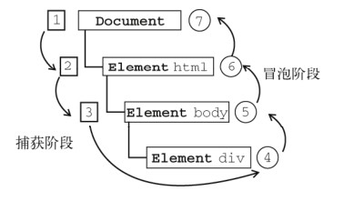
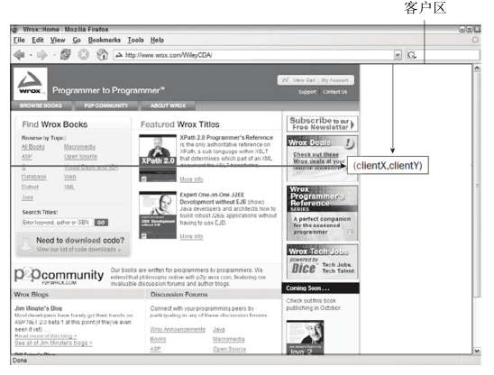

# 事件

​	JavaScript 与 HTML 之间的交互是通过事件实现的。事件，就是文档或浏览器窗口中发生的一些特定的交互瞬间。可以使用侦听器（或处理程序）来预订事件，以便事件发生时执行相应的代码。这种在传统软件工程中被称为**观察员模式**的模型，支持页面的行为（JavaScript 代码）与页面的外观（HTML 和 CSS 代码）之间的松散耦合。

## 事件流

​	**事件流描述的是从页面中接收事件的顺序。**

​	但有意思的是，IE 和 Netscape 开发团队居然提出了差不多是完全相反的事件流的概念。IE 的事件流是**事件冒泡流**，而 Netscape Communicator 的事件流是**事件捕获流**。	

### 事件冒泡

​	IE 的事件流叫做**事件冒泡（event bubbling）**，即事件开始时由最具体的元素（文档中嵌套层次最深
的那个节点）接收，然后逐级向上传播到较为不具体的节点（文档）。以下面的 HTML 页面为例：

```html
<!DOCTYPE html>
<html>
	<head>
		<title>Event Bubbling Example</title>
	</head>
	<body>
		<div id="myDiv">Click Me</div>
	</body>
</html>
```

如果你单击了页面中的` <div> `元素，那么这个 click 事件会按照如下顺序传播：
(1)` <div>`
(2)` <body>`
(3) `<html>`
(4) document

​	所有现代浏览器都支持事件冒泡，但在具体实现上还是有一些差别。IE5.5 及更早版本中的事件冒泡会跳过 `<html> `元素（从` <body> `直接跳到 document ）。IE9、Firefox、Chrome 和 Safari 则将事件一直冒泡到 window 对象。

### 事件捕获

​	Netscape Communicator团队提出的另一种事件流叫做事件捕获（event capturing）。事件捕获的思想是不太具体的节点应该更早接收到事件，而最具体的节点应该最后接收到事件。事件捕获的用意在于在事件到达预定目标之前捕获它。如果仍以前面的 HTML 页面作为演示事件捕获的例子，那么单击 `<div>`元素就会以下列顺序触发 click 事件。

(1) document

(2)` <html>`
(3)` <body>`
(4) `<div>`

​	虽然事件捕获是 Netscape Communicator 唯一支持的事件流模型，但 IE9、Safari、Chrome、Opera和 Firefox 目前也都支持这种事件流模型。

### DOM事件流

​	“DOM2级事件”规定的事件流包括三个阶段：事件捕获阶段、处于目标阶段和事件冒泡阶段。首先发生的是事件捕获，为截获事件提供了机会。然后是实际的目标接收到事件。最后一个阶段是冒泡阶段，可以在这个阶段对事件做出响应。以前面简单的 HTML 页面为例，单击` <div> `元素会按照图13-3所示顺序触发事件。



​	在 DOM 事件流中，实际的目标（ `<div>` 元素）在捕获阶段不会接收到事件。这意味着在捕获阶段，事件从 document 到` <html>` 再到` <body> `后就停止了。下一个阶段是“处于目标”阶段，于是事件在` <div>`上发生，并在事件处理（后面将会讨论这个概念）中被看成冒泡阶段的一部分。然后，冒泡阶段发生，事件又传播回文档。

​	多数支持 DOM事件流的浏览器都实现了一种特定的行为；即使“DOM2 级事件”规范明确要求捕获阶段不会涉及事件目标，但 IE9、Safari、Chrome、Firefox 和 Opera 9.5 及更高版本都会在捕获阶段触发事件对象上的事件。结果，就是有两个机会在目标对象上面操作事件。

## 事件处理程序

​	事件就是用户或浏览器自身执行的某种动作。诸如 click 、 load 和 mouseover ，都是事件的名字。而响应某个事件的函数就叫做事件处理程序（或事件侦听器）。事件处理程序的名字以 "on" 开头，因此click 事件的事件处理程序就是 onclick ， load 事件的事件处理程序就是 onload 。为事件指定处理程序的方式有好几种。

### HTML事件处理程序

​	某个元素支持的每种事件，都可以使用一个与相应事件处理程序同名的 HTML 特性来指定。这个特性的值应该是能够执行的 JavaScript 代码。例如，要在按钮被单击时执行一些 JavaScript，可以像下面这样编写代码：

```html
<input type="button" value="Click Me" onclick="alert('Clicked')" />
```

​	当单击这个按钮时，就会显示一个警告框。这个操作是通过指定 onclick 特性并将一些 JavaScript代码作为它的值来定义的。由于这个值是 JavaScript，因此不能在其中使用未经转义的 HTML 语法字符，例如和号（&）、双引号（""）、小于号（<）或大于号（>）。为了避免使用 HTML 实体，这里使用了单引号。如果想要使用双引号，那么就要将代码改写成如下所示：

```html
<input type="button" value="Click Me" onclick="alert(&quot;Clicked&quot;)" />
```

​	在这个例子中，单击按钮就会调用 showMessage() 函数。这个函数是在一个独立的 `<script> `元素中定义的，当然也可以被包含在一个外部文件中。事件处理程序中的代码在执行时，有权访问全局作用域中的任何代码。

​	这样指定事件处理程序具有一些独到之处。首先，这样会创建一个封装着元素属性值的函数。这个函数中有一个局部变量 event ，也就是事件对象：

```javascript
<!-- 输出 "click" -->
<input type="button" value="Click Me" onclick="alert(event.type)">
```

​	通过 event 变量，可以直接访问事件对象，你不用自己定义它，也不用从函数的参数列表中读取。在这个函数内部， this 值等于事件的目标元素，例如：

```html
<!-- 输出 "Click Me" -->
<input type="button" value="Click Me" onclick="alert(this.value)">
```

​	关于这个动态创建的函数，另一个有意思的地方是它扩展作用域的方式。在这个函数内部，可以像访问局部变量一样访问 document 及该元素本身的成员。这个函数使用 with 像下面这样扩展作用域：

```javascript
function(){
	with(document){
		with(this){
			//元素属性值
		}
	}
}
```

如此一来，事件处理程序要访问自己的属性就简单多了。下面这行代码与前面的例子效果相同：

```html
<!-- 输出 "Click Me" -->
<input type="button" value="Click Me" onclick="alert(value)">
```

​	如果当前元素是一个表单输入元素，则作用域中还会包含访问表单元素（父元素）的入口，这个函数就变成了如下所示：

```javascript
function(){
	with(document){
		with(this.form){
			with(this){
				//元素属性值
			}
		}
	}
}
```

​	实际上，这样扩展作用域的方式，无非就是想让事件处理程序无需引用表单元素就能访问其他表单字段。例如：

```html
<form method="post">
	<input type="text" name="username" value="">
	<input type="button" value="Echo Username" onclick="alert(username.value)">	
</form>
```

​	在这个例子中，单击按钮会显示文本框中的文本。值得注意的是，这里直接引用了 username 元素。

​	不过，在 HTML 中指定事件处理程序有两个缺点。首先，存在一个时差问题。因为用户可能会在HTML 元素一出现在页面上就触发相应的事件，但当时的事件处理程序有可能尚不具备执行条件。以前面的例子来说明，假设 showMessage() 函数是在按钮下方、页面的最底部定义的。如果用户在页面解析 showMessage() 函数之前就单击了按钮，就会引发错误。为此，很多 HTML 事件处理程序都会被封装在一个 try-catch 块中，以便错误不会浮出水面，如下面的例子所示：

```html
<input type="button" value="Click Me" onclick="try{showMessage();}catch(ex){}">
```

### DOM0 级事件处理程序

​	通过 JavaScript 指定事件处理程序的传统方式，就是将一个函数赋值给一个事件处理程序属性。这种为事件处理程序赋值的方法是在第四代 Web 浏览器中出现的，而且至今仍然为所有现代浏览器所支持。原因一是简单，二是具有跨浏览器的优势。要使用 JavaScript 指定事件处理程序，首先必须取得一个要操作的对象的引用。

​	每个元素（包括 window 和 document ）都有自己的事件处理程序属性，这些属性通常全部小写，例如 onclick 。将这种属性的值设置为一个函数，就可以指定事件处理程序，如下所示：

```javascript
var btn = document.getElementById("myBtn");
	btn.onclick = function(){
	alert("Clicked");
};
```

​	使用 DOM0 级方法指定的事件处理程序被认为是元素的方法。因此，这时候的事件处理程序是在元素的作用域中运行；换句话说，程序中的 this 引用当前元素。来看一个例子：

```javascript
var btn = document.getElementById("myBtn");
	btn.onclick = function(){
	alert(this.id); //"myBtn"
}
btn.onclick = null; //删除事件处理程序
```

### DOM2 级事件处理程序

​	“DOM2级事件”定义了两个方法，用于处理指定和删除事件处理程序的操作： addEventListener()和 removeEventListener() 。所有 DOM 节点中都包含这两个方法，并且它们都接受 3 个参数：要处理的事件名、作为事件处理程序的函数和一个布尔值。最后这个布尔值参数如果是 true ，表示在捕获阶段调用事件处理程序；如果是 false ，表示在冒泡阶段调用事件处理程序。

​	要在按钮上为 click 事件添加事件处理程序，可以使用下列代码：

```javascript
var btn = document.getElementById("myBtn");
btn.addEventListener("click", function() {
    alert(this.id);
}, true);
```

​	使用 DOM2 级方法添加事件处理程序的主要好处是可以添加多个事件处理程序。来看下面的例子：

```javascript
var btn = document.getElementById("myBtn");
	btn.addEventListener("click", function(){
	alert(this.id);
}, false);
btn.addEventListener("click", function(){
	alert("Hello world!");
}, false);
```

​	这里为按钮添加了两个事件处理程序。这两个事件处理程序会按照添加它们的顺序触发，因此首先会显示元素的 ID，其次会显示 "Hello world!" 消息。

​	通过 addEventListener() 添加的事件处理程序只能使用 removeEventListener() 来移除；移除时传入的参数与添加处理程序时使用的参数相同。这也意味着通过 addEventListener() 添加的匿名函数将无法移除，如下面的例子所示：

```javascript
var btn = document.getElementById("myBtn");
	btn.addEventListener("click", function(){
	alert(this.id);
}, false);
// 这里省略了其他代码
btn.removeEventListener("click", function(){ // 没有用！
	alert(this.id);
}, false);
```

​	在这个例子中，我们使用 addEventListener() 添加了一个事件处理程序。虽然调用 removeEventListener() 时看似使用了相同的参数，但实际上，第二个参数与传入 addEventListener() 中的那一个是完全不同的函数。而传入 removeEventListener() 中的事件处理程序函数必须与传入addEventListener() 中的相同，如下面的例子所示：

```javascript
var btn = document.getElementById("myBtn");
		var handler = function(){
alert(this.id);
};
btn.addEventListener("click", handler, false);
// 这里省略了其他代码
btn.removeEventListener("click", handler, false); // 有效！
```

### IE事件处理程序

​	IE 实现了与 DOM 中类似的两个方法： attachEvent() 和 detachEvent() 。这两个方法接受相同的两个参数：事件处理程序名称与事件处理程序函数。由于 IE8 及更早版本只支持事件冒泡，所以通过attachEvent() 添加的事件处理程序都会被添加到冒泡阶段。

​	要使用 attachEvent() 为按钮添加一个事件处理程序，可以使用以下代码：

```javascript
var btn = document.getElementById("myBtn");
	btn.attachEvent("onclick", function(){
	alert("Clicked");
});
```

**注意， attachEvent() 的第一个参数是 "onclick" ，而非 DOM 的 addEventListener() 方法中的 "click" 。**

​	在 IE 中使用 attachEvent() 与使用 DOM0 级方法的主要区别在于事件处理程序的作用域。在使用 DOM0 级方法的情况下，事件处理程序会在其所属元素的作用域内运行；在使用 attachEvent() 方法的情况下，事件处理程序会在全局作用域中运行，因此 this 等于 window 。来看下面的例子：

```javascript
var btn = document.getElementById("myBtn");
	btn.attachEvent("onclick", function(){
	alert(this === window); //true
});
```

**在编写跨浏览器的代码时，牢记这一区别非常重要。**

​	与 addEventListener() 类似， attachEvent() 方法也可以用来为一个元素添加多个事件处理程序。

​	使用 attachEvent() 添加的事件可以通过 detachEvent() 来移除，条件是必须提供相同的参数。与 DOM 方法一样，这也意味着添加的匿名函数将不能被移除。

### 跨浏览器的事件处理程序

```javascript
var EventUtil = {
    addHandler: function(element, type, handler){
        //省略的代码
        if (element.addEventListener) {
            element.addEventListener(type, handler, true);
        } else if (element.attachEvent) {
            element.attachEvent(type, handler);
        }
    },
    getEvent: function(event){
        return event ? event : window.event;
    },
    getTarget: function(event){
        return event.target || event.srcElement;
    },
    preventDefault: function(event){
        if (event.preventDefault){
            event.preventDefault();
        } else {
            event.returnValue = false;
        }
    },
    removeHandler: function(element, type, handler){
        //省略的代码
    },
    stopPropagation: function(event){
        if (event.stopPropagation){
            event.stopPropagation();
        } else {
            event.cancelBubble = true;
        }
    }
};
```


**********************************

## 事件对象

​	在触发 DOM 上的某个事件时，会产生一个事件对象 event ，这个对象中包含着所有与事件有关的信息。包括导致事件的元素、事件的类型以及其他与特定事件相关的信息。例如，鼠标操作导致的事件对象中，会包含鼠标位置的信息，而键盘操作导致的事件对象中，会包含与按下的键有关的信息。所有浏览器都支持 event 对象，但支持方式不同。

#### DOM中的事件对象

```javascript
var btn = document.getElementById("myBtn");
	btn.onclick = function(event){
	alert(event.type); //"click"
};
btn.addEventListener("click", function(event){
	alert(event.type); //"click"
}, false);
```

​	这个例子中的两个事件处理程序都会弹出一个警告框，显示由 event.type 属性表示的事件类型。这个属性始终都会包含被触发的事件类型，例如 "click" （与传入 addEventListener() 和removeEventListener() 中的事件类型一致）。

​	在通过 HTML 特性指定事件处理程序时，变量 event 中保存着 event 对象。请看下面的例子：

```html
<input type="button" value="Click Me" onclick="alert(event.type)"/>
```

​	以这种方式提供 event 对象，可以让 HTML 特性事件处理程序与 JavaScript 函数执行相同的操作。
​	event 对象包含与创建它的特定事件有关的属性和方法。触发的事件类型不一样，可用的属性和方法也不一样。不过，所有事件都会有下表列出的成员。

| 属性/方法 | 类型 | 读/写 | 说明 |
| --------- | ---- | ----- | ---- |
|           |      |       |      |

在需要通过一个函数处理多个事件时，可以使用 type 属性。例如：

```javascript
var btn = document.getElementById("myBtn");
var handler = function(event){
	switch(event.type){
		case "click":
			alert("Clicked");
			break;
		case "mouseover":
			event.target.style.backgroundColor = "red";
			break;
		case "mouseout":
			event.target.style.backgroundColor = "";
			break;
	}
};
btn.onclick = handler;
btn.onmouseover = handler;
btn.onmouseout = handler;
```

#### IE中的事件对象

​	与访问 DOM 中的 event 对象不同，要访问 IE 中的 event 对象有几种不同的方式，取决于指定事件处理程序的方法。在使用 DOM0 级方法添加事件处理程序时， event 对象作为 window 对象的一个属性存在。来看下面的例子：

```javascript
var btn = document.getElementById("myBtn");
	btn.onclick = function(){
	var event = window.event;
	alert(event.type); //"click"
};
```

​	在此，我们通过 window.event 取得了 event 对象，并检测了被触发事件的类型（IE 中的 type属性与 DOM 中的 type 属性是相同的）。可是，如果事件处理程序是使用 attachEvent() 添加的，那么就会有一个 event 对象作为参数被传入事件处理程序函数中，如下所示：

```javascript
var btn = document.getElementById("myBtn");
	btn.attachEvent("onclick", function(event){
	alert(event.type); //"click"
});
```

​	在像这样使用 attachEvent() 的情况下，也可以通过 window 对象来访问 event 对象，就像使用DOM0 级方法时一样。不过为方便起见，同一个对象也会作为参数传递。如果是通过HTML特性指定的事件处理程序，那么还可以通过一个名叫 event 的变量来访问 event对象（与 DOM中的事件模型相同）。

```html
<input type="button" value="Click Me" onclick="alert(event.type)">
```

​	因为事件处理程序的作用域是根据指定它的方式来确定的，所以不能认为 this 会始终等于事件目标。故而，最好还是使用 event.srcElement 比较保险。例如：

```javascript
var btn = document.getElementById("myBtn");
	btn.onclick = function(){
	alert(window.event.srcElement === this); //true
};
btn.attachEvent("onclick", function(event){
	alert(event.srcElement === this); //false
});
```

## 事件类型

​	Web 浏览器中可能发生的事件有很多类型。如前所述，不同的事件类型具有不同的信息，而“DOM3级事件”规定了以下几类事件：

- UI（User Interface，用户界面）事件，当用户与页面上的元素交互时触发；
- 焦点事件，当元素获得或失去焦点时触发；
- 鼠标事件，当用户通过鼠标在页面上执行操作时触发；
- 滚轮事件，当使用鼠标滚轮（或类似设备）时触发；
- 文本事件，当在文档中输入文本时触发；
- 键盘事件，当用户通过键盘在页面上执行操作时触发；
- 合成事件，当为 IME（Input Method Editor，输入法编辑器）输入字符时触发；
- 变动（mutation）事件，当底层 DOM 结构发生变化时触发。
- 变动名称事件，当元素或属性名变动时触发。此类事件已经被废弃，没有任何浏览器实现它们，因此本章不做介绍。

​	除了这几类事件之外，HTML5 也定义了一组事件，而有些浏览器还会在 DOM 和 BOM中实现其他专有事件。这些专有的事件一般都是根据开发人员需求定制的，没有什么规范，因此不同浏览器的实现有可能不一致。

### UI事件

​	UI 事件指的是那些不一定与用户操作有关的事件。这些事件在 DOM 规范出现之前，都是以这种或那种形式存在的，而在 DOM规范中保留是为了向后兼容。现有的 UI 事件如下：

- DOMActivate ：表示元素已经被用户操作（通过鼠标或键盘）激活。这个事件在 DOM3 级事件中被废弃，但 Firefox 2+和 Chrome 支持它。考虑到不同浏览器实现的差异，不建议使用这个事件。
- load ：当页面完全加载后在 window 上面触发，当所有框架都加载完毕时在框架集上面触发，当图像加载完毕时在 ` `元素上面触发，或者当嵌入的内容加载完毕时在 `<object>`元素上面触发。
- unload ：当页面完全卸载后在 window 上面触发，当所有框架都卸载后在框架集上面触发，或者当嵌入的内容卸载完毕后在 `<object> `元素上面触发。
- abort ：在用户停止下载过程时，如果嵌入的内容没有加载完，则在` <object> `元素上面触发。
- error ：当发生 JavaScript 错误时在 window 上面触发，当无法加载图像时在`  `元素上面触发，当无法加载嵌入内容时在` <object>` 元素上面触发，或者当有一或多个框架无法加载时在框架集上面触发。
- select ：当用户选择文本框（` <input> `或` <texterea>` ）中的一或多个字符时触发。
- resize ：当窗口或框架的大小变化时在 window 或框架上面触发。
- scroll ：当用户滚动带滚动条的元素中的内容时，在该元素上面触发。` <body>` 元素中包含所加载页面的滚动条。

​	多数这些事件都与 window 对象或表单控件相关。

​	除了 DOMActivate 之外，其他事件在 DOM2级事件中都归为 HTML 事件（ DOMActivate 在 DOM2级中仍然属于 UI 事件）。要确定浏览器是否支持 DOM2 级事件规定的 HTML 事件，可以使用如下代码：

```javascript
var isSupported = document.implementation.hasFeature("HTMLEvents", "2.0");
```

​	注意，只有根据“DOM2 级事件”实现这些事件的浏览器才会返回 true 。而以非标准方式支持这些事件的浏览器则会返回 false 。要确定浏览器是否支持“DOM3 级事件”定义的事件，可以使用如下代码：

```javascript
var isSupported = document.implementation.hasFeature("UIEvent", "3.0");
```

#### load 事件

​	JavaScript 中最常用的一个事件就是 load 。当页面完全加载后（包括所有图像、JavaScript 文件、CSS 文件等外部资源），就会触发 window 上面的 load 事件。有两种定义 onload 事件处理程序的方式。第一种方式是使用如下所示的 JavaScript 代码：

```javascript
EventUtil.addHandler(window, "load", function(event){
	alert("Loaded!");
});
```

​	第二种指定 onload 事件处理程序的方式是为 <body> 元素添加一个 onload 特性，如下面的例子所示：

```html
<!DOCTYPE html>
<html>
	<head>
		<title>Load Event Example</title>
	</head>
	<body onload="alert('Loaded!')">
	</body>
</html>
```

​	一般来说，在 window 上面发生的任何事件都可以在 <body> 元素中通过相应的特性来指定，因为在 HTML 中无法访问 window 元素。

​	图像上面也可以触发 load 事件，无论是在 DOM 中的图像元素还是 HTML 中的图像元素。因此，可以在 HTML 中为任何图像指定 onload 事件处理程序，例如：

```javascript

```

```javascript
var image = document.getElementById("myImage");
EventUtil.addHandler(image, "load", function(event){
	event = EventUtil.getEvent(event);
	alert(EventUtil.getTarget(event).src);
});
```

​	在创建新的`  `元素时，可以为其指定一个事件处理程序，以便图像加载完毕后给出提示。此时，最重要的是要在指定 src 属性之前先指定事件，如下面的例子所示：

```javascript
EventUtil.addHandler(window, "load", function(){
	var image = document.createElement("img");
	EventUtil.addHandler(image, "load", function(event){
		event = EventUtil.getEvent(event);
		alert(EventUtil.getTarget(event).src);
	});
	document.body.appendChild(image);
	image.src = "smile.gif";
});
```

####  unload 事件

​	与 load 事件对应的是 unload 事件，这个事件在文档被完全卸载后触发。只要用户从一个页面切换到另一个页面，就会发生 unload 事件。而利用这个事件最多的情况是清除引用，以避免内存泄漏。与 load 事件类似，也有两种指定 onunload 事件处理程序的方式。第一种方式是使用 JavaScript，如下所示：

```javascript
EventUtil.addHandler(window, "unload", function(event){
	alert("Unloaded");
});
```

​	指定事件处理程序的第二种方式，也是为` <body> `元素添加一个特性（与 load 事件相似） ，如下面的例子所示：

```html
<!DOCTYPE html>
<html>
	<head>
		<title>Unload Event Example</title>
	</head>
	<body onunload="alert('Unloaded!')">
	</body>
</html>
```

​	无论使用哪种方式，都要小心编写 onunload 事件处理程序中的代码。既然 unload 事件是在一切都被卸载之后才触发，那么在页面加载后存在的那些对象，此时就不一定存在了。此时，操作 DOM节点或者元素的样式就会导致错误。

#### resize事件

​	当浏览器窗口被调整到一个新的高度或宽度时，就会触发 resize 事件。这个事件在 window （窗口）上面触发，因此可以通过 JavaScript 或者 `<body> `元素中的 onresize 特性来指定事件处理程序。如：

```javascript
EventUtil.addHandler(window, "resize", function(event){
	alert("Resized");
});
```

#### scroll事件

​	虽然 scroll 事件是在 window 对象上发生的，但它实际表示的则是页面中相应元素的变化。在混杂模式下，可以通过 `<body> `元素的 scrollLeft 和 scrollTop 来监控到这一变化；而在标准模式下，除 Safari 之外的所有浏览器都会通过` <html>` 元素来反映这一变化（Safari 仍然基于` <body> `跟踪滚动位置） ：

```javascript
EventUtil.addHandler(window, "scroll", function(event){
	if (document.compatMode == "CSS1Compat"){
		alert(document.documentElement.scrollTop);
	} else {
		alert(document.body.scrollTop);
	}
});
```

### 焦点事件

​	焦点事件会在页面元素获得或失去焦点时触发。 利用这些事件并与 document.hasFocus() 方法及document.activeElement 属性配合，可以知晓用户在页面上的行踪。有以下 6 个焦点事件：

- blur ：在元素失去焦点时触发。这个事件不会冒泡；所有浏览器都支持它。
- DOMFocusIn ：在元素获得焦点时触发。这个事件与 HTML 事件 focus 等价，但它冒泡。只有Opera 支持这个事件。DOM3 级事件废弃了 DOMFocusIn ，选择了 focusin 。
- DOMFocusOut ： 在元素失去焦点时触发。 这个事件是 HTML 事件 blur 的通用版本。 只有 Opera支持这个事件。DOM3 级事件废弃了 DOMFocusOut ，选择了 focusout 。
- focus ：在元素获得焦点时触发。这个事件不会冒泡；所有浏览器都支持它。
- focusin ：在元素获得焦点时触发。这个事件与 HTML 事件 focus 等价，但它冒泡。支持这个事件的浏览器有 IE5.5+、Safari 5.1+、Opera 11.5+和 Chrome。
- focusout ：在元素失去焦点时触发。这个事件是 HTML 事件 blur 的通用版本。支持这个事件的浏览器有 IE5.5+、Safari 5.1+、Opera 11.5+和 Chrome。

​	这一类事件中最主要的两个是 focus 和 blur ，它们都是 JavaScript 早期就得到所有浏览器支持的事件。 这些事件的最大问题是它们不冒泡。 因此， IE 的 focusin 和 focusout 与 Opera 的 DOMFocusIn和 DOMFocusOut 才会发生重叠。IE 的方式最后被 DOM3 级事件采纳为标准方式。

​	当焦点从页面中的一个元素移动到另一个元素，会依次触发下列事件：

- focusout 在失去焦点的元素上触发；
-  focusin 在获得焦点的元素上触发；
-  blur 在失去焦点的元素上触发；
-  DOMFocusOut 在失去焦点的元素上触发；
-  focus 在获得焦点的元素上触发；
-  DOMFocusIn 在获得焦点的元素上触发。

其中， blur 、 DOMFocusOut 和 focusout 的事件目标是失去焦点的元素； 而 focus 、 DOMFocusIn和 focusin 的事件目标是获得焦点的元素。

​	要确定浏览器是否支持这些事件，可以使用如下代码：

```javascript
var isSupported = document.implementation.hasFeature("FocusEvent", "3.0");
```

### 鼠标与滚轮事件

​	鼠标事件是 Web 开发中最常用的一类事件，毕竟鼠标还是最主要的定位设备。DOM3 级事件中定义了 9 个鼠标事件，简介如下：

- click ：在用户单击主鼠标按钮（一般是左边的按钮）或者按下回车键时触发。这一点对确保易访问性很重要，意味着 onclick 事件处理程序既可以通过键盘也可以通过鼠标执行。
- dblclick ：在用户双击主鼠标按钮（一般是左边的按钮）时触发。从技术上说，这个事件并不是 DOM2 级事件规范中规定的， 但鉴于它得到了广泛支持， 所以 DOM3 级事件将其纳入了标准。
- mousedown ：在用户按下了任意鼠标按钮时触发。不能通过键盘触发这个事件。
- mouseenter ：在鼠标光标从元素外部首次移动到元素范围之内时触发。这个事件不冒泡，而且在光标移动到后代元素上不会触发。DOM2 级事件并没有定义这个事件，但 DOM3 级事件将它纳入了规范。IE、Firefox 9+和 Opera 支持这个事件。
- mouseleave ：在位于元素上方的鼠标光标移动到元素范围之外时触发。这个事件不冒泡，而且在光标移动到后代元素上不会触发。DOM2 级事件并没有定义这个事件，但 DOM3 级事件将它纳入了规范。IE、Firefox 9+和 Opera 支持这个事件。
- mousemove ：当鼠标指针在元素内部移动时重复地触发。不能通过键盘触发这个事件。
- mouseout ：在鼠标指针位于一个元素上方，然后用户将其移入另一个元素时触发。又移入的另一个元素可能位于前一个元素的外部， 也可能是这个元素的子元素。 不能通过键盘触发这个事件。
- mouseover ：在鼠标指针位于一个元素外部，然后用户将其首次移入另一个元素边界之内时触发。不能通过键盘触发这个事件。
- mouseup ：在用户释放鼠标按钮时触发。不能通过键盘触发这个事件。

页面上的所有元素都支持鼠标事件。除了 mouseenter 和 mouseleave ，所有鼠标事件都会冒泡，也可以被取消，而取消鼠标事件将会影响浏览器的默认行为。取消鼠标事件的默认行为还会影响其他事件，因为鼠标事件与其他事件是密不可分的关系。

​	只有在同一个元素上相继触发 mousedown 和 mouseup 事件，才会触发 click 事件；如果mousedown 或 mouseup 中的一个被取消，就不会触发 click 事件。类似地，只有触发两次 click 事件， 才会触发一次 dblclick 事件。 如果有代码阻止了连续两次触发 click 事件 （可能是直接取消 click事件，也可能通过取消 mousedown 或 mouseup 间接实现） ，那么就不会触发 dblclick 事件了。这 4个事件触发的顺序始终如下：

1. mousedown
2.  mouseup
3.  click
4. mousedown
5.  mouseup
6. click
7. dblclick

使用以下代码可以检测浏览器是否支持以上 DOM2 级事件（除 dbclick 、 mouseenter 和mouseleave 之外） ：

```javascript
var isSupported = document.implementation.hasFeature("MouseEvents", "2.0");
```

要检测浏览器是否支持上面的所有事件，可以使用以下代码：

```javascript
var isSupported = document.implementation.hasFeature("MouseEvent", "3.0")
```

**注意**：DOM3 级事件的 feature 名是 "MouseEvent" ，而非 "MouseEvents" 。

#### 客户区坐标位置

​	鼠标事件都是在浏览器视口中的特定位置上发生的。这个位置信息保存在事件对象的 clientX 和clientY 属性中。所有浏览器都支持这两个属性，它们的值表示事件发生时鼠标指针在视口中的水平和垂直坐标。



可以使用类似下列代码取得鼠标事件的客户端坐标信息：

```javascript
var div = document.getElementById("myDiv");
	EventUtil.addHandler(div, "click", function(event){
	event = EventUtil.getEvent(event);
	alert("Client coordinates: " + event.clientX + "," + event.clientY);
});
```

#### 修改键

​	虽然鼠标事件主要是使用鼠标来触发的， 但在按下鼠标时键盘上的某些键的状态也可以影响到所要采取的作。这些修改键就是 Shift、Ctrl、Alt 和 Meta（在 Windows键盘中是 Windows键，在苹果机中是 Cmd 键） 它们经常被用来修改鼠标事件的行为。DOM 为此规定了 4 个属性，表示这些修改键的状态： shiftKey 、 ctrlKey 、 altKey 和 metaKey 。这些属性中包含的都是布尔值，如果相应的键被按下了，则值为 true ，否则值为 false 。当某个鼠标事件发生时，通过检测这几个属性就可以确定用户是否同时按下了其中的键。

```javascript
function setKey() {
    var div = document.getElementById("myDiv");
    EventUtil.addHandler(div, "click", function (event) {
        event = EventUtil.getEvent(event);
        var keys = new Array();
        if (event.shiftKey) {
            keys.push("shift");
        }
        if (event.ctrlKey) {
            keys.push("ctrl");
        }
        if (event.altKey) {
            keys.push("alt");
        }
        if (event.metaKey) {
            keys.push("meta");
        }
        alert("Keys: " + keys.join(","));
    });
}
```

#### 鼠标按钮

​	只有在主鼠标按钮被单击（或键盘回车键被按下）时才会触发 click 事件，因此检测按钮的信息并不是必要的。但对于 mousedown 和 mouseup 事件来说，则在其 event 对象存在一个 button 属性，表示按下或释放的按钮。DOM 的 button 属性可能有如下 3 个值： 0 表示主鼠标按钮， 1 表示中间的鼠标按钮（鼠标滚轮按钮） ， 2 表示次鼠标按钮。在常规的设置中，主鼠标按钮就是鼠标左键，而次鼠标按钮就是鼠标右键。

- 0 ：表示没有按下按钮。
- 1 ：表示按下了主鼠标按钮。
- 2 ：表示按下了次鼠标按钮。
- 3 ：表示同时按下了主、次鼠标按钮。
- 4 ：表示按下了中间的鼠标按钮。
- 5 ：表示同时按下了主鼠标按钮和中间的鼠标按钮。
-  6 ：表示同时按下了次鼠标按钮和中间的鼠标按钮。
- 7 ：表示同时按下了三个鼠标按钮。

​	不难想见，DOM模型下的 button 属性比 IE 模型下的 button 属性更简单也更为实用，因为同时按下多个鼠标按钮的情形十分罕见。最常见的做法就是将 IE 模型规范化为 DOM 方式，毕竟除 IE8 及更早版本之外的其他浏览器都原生支持 DOM模型。而对主、中、次按钮的映射并不困难，只要将 IE 的其他选项分别转换成如同按下这三个按键中的一个即可（同时将主按钮作为优先选取的对象） 。换句话说，IE 中返回的 5 和 7 会被转换成 DOM 模型中的 0 。

​	由于单独使用能力检测无法确定差异（两种模型有同名的 button 属性） ，因此必须另辟蹊径。我们知道，支持 DOM 版鼠标事件的浏览器可以通过 hasFearture() 方法来检测，所以可以再为EventUtil 对象添加如下 getButton() 方法。

```javascript
var EventUtil = {
//省略了其他代码
    getButton: function (event) {
        if (document.implementation.hasFeature("MouseEvents", "2.0")) {
            return event.button;
        } else {
            switch (event.button) {
                case 0:
                case 1:
                case 3:
                case 5:
                case 7:
                    return 0;
                case 2:
                case 6:
                    return 2;
                case 4:
                    return 1;
            }
        }
    },
//省略了其他代码
};
```

​	通过检测 "MouseEvents" 这个特性，就可以确定 event 对象中存在的 button 属性中是否包含正确的值。如果测试失败，说明是 IE，就必须对相应的值进行规范化。以下是使用该方法的示例：

```javascript
var div = document.getElementById("myDiv");
EventUtil.addHandler(div, "mousedown", function(event){
	event = EventUtil.getEvent(event);
	alert(EventUtil.getButton(event));
});
```

