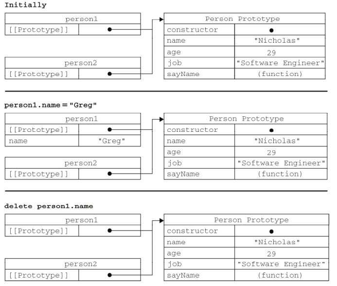
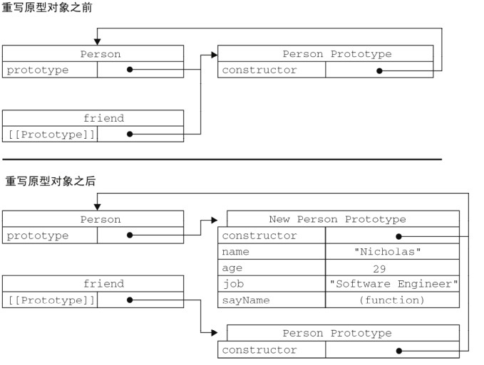
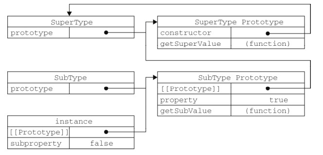
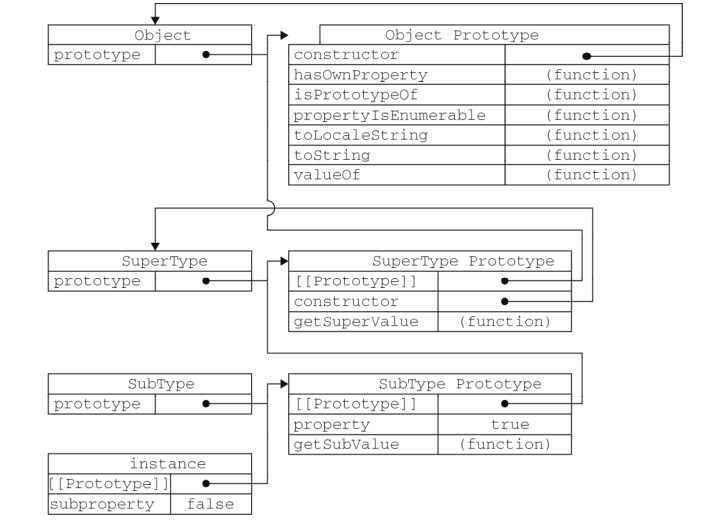
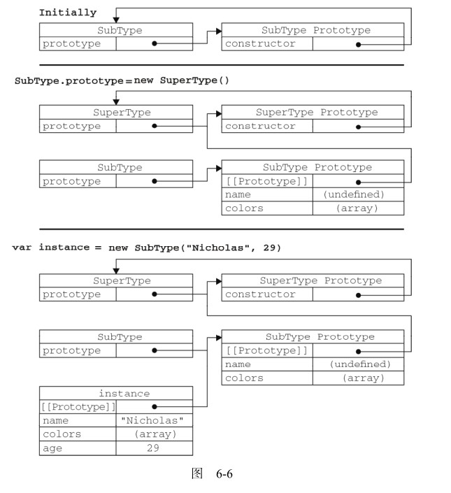

# 面向对象总结

  **在Javascript中不存在类的说法，ECMA把对象定义为`无序属性的集合，其属性可以包含基本值、对象或者函数`**。也就是说对象就是一个散列表：一组名值对，值可以是任何东西。

- 举例：

  ```javascript
  var op = new Object();
  op.name = "ywl";
  op.age = 23;
  op.get_name = function () {
      console.log(this.name);
  };
  
  op.get_name();
  op["get_name"]();
  ```

  输出：

  ```shell
  ywl
  ywl
  ```

  等同于：

  ```javascript
  var op = {
      name : "ywl",
      age : 23,
      get_name : function (){
          console.log(this.name);
      }
  };
  
  op.get_name();
  op["get_name"]();
  ```

## 属性类型

- 对象的属性类型，也可以理解为属性(property)的特性(attribute)。即对象中每个属性的特性。特性分为两种：数据特性和访问特性。

- 数据特性存在下面4个：

  - `[[Configurable]]`：表示能否通过 `delete` 删除属性从而重新定义属性(如果设置为`false`，该属性是不能通过`delete`删除的)，能否修改属性的特性，或者能否把属性修改为访问器属性。像前面例子中那样直接在对象上定义的属性，它们的这个特性默认值为 `true`。

    ```javascript
    var op = {
        name : "ywl",
        age : 23,
        get_name : function (){
            console.log(this.name);
        }
    };
    
    var pro = Object.getOwnPropertyDescriptor(op, "name");  // 获取属性的特性
    console.log(pro.configurable);
    ```

  - `[[Enumerable]]`：表示能否通过for-in循环返回属性。默认是`true`。

  - `[[Writeable]]`：表示能否修改属性值。默认是`true`。

  - `[[Value]]`：就包含属性的数据值。默认是`undefined`相当于没有初始化。

  - 要修改属性的特性必须使用`Object.defineProperty()`方法。该方法接收3个参数：

    - 对象名

    - 属性名

    - 特性名值对

      ```javascript
      var op = {
          name : "ywl",
          age : 23,
          get_name : function (){
              console.log(this.name);
          }
      };
      
      Object.defineProperty(op, "name", {
          writable : false,
          value : "ubuntu"
      });
      // 没有设置的特性将是默认值。
      op.get_name();
      ```

      输出：

      ```shell
      ubuntu
      ```

  - 如果设置了`confiurable`为`false`，那么无法修改回来，而且除了`writable`可以设置外，其他特性无法设置。一般没有必要修改特性。

- 访问器特性。

  - `[[Configurable]]`：

  - `[[Writeable]]`：

  - `[[Get]]`：在读取属性时调用的函数。默认值为 undefined 。

  - `[[Set]]`：在写入属性时调用的函数。默认值为 undefined 。

    ```javascript
    var op = {
        _name : "javascript",  // _ 标识私有属性，只能通过对象方法来访问
        age : 23,
    };
    
    Object.defineProperty(op, "name", { 
        get : function () {
            return this._name;
        },
        set : function (new_name) {
            this._name = new_name + " new";
        }
    });
    
    console.log(op.name);
    op.name = "new js";
    console.log(op.name);
    ```

    name属性包含`getter`和`setter`两个函数，访问和修改name的属性最终会传递放到_name属性，这种方式是使用访问器特性的常用方式，修改一个属性来间接修改另一个内部属性。

    **如果只指定get或set，那么另外一种特性将会是undefined，即无法设置或读取。**

- 如果要一次性定义多个属性的特性使用`Object.defineProperties()`：

  ```javascript
  var op = {
      _name : "javascript",
      age : 23,
  };
  
  Object.defineProperties(op, {
      name : {
          get : function () {
              return this._name;
          },
          
          set : function (new_name) {
              this._name = new_name + " new";
          }    
      },
      age : {
          writable : true
      }
  });
  ```

- `Object.getOwnPropertyDescriptor()`可以取得给定属性的描述符。这个方法接收两个参数：属性所在的对象和要读取其描述符的属性名称。返回值是一个对象，如果是访问器属性，这个对象的属性有configurable、 enumerable 、 get 和 set ；如果是数据属性，这个对象的属性有 configurable 、enumerable 、 writable 和 value 。

## 创建对象

- 通过`Object`和字面量(直接定义键值对)的方式可以创建对象，但是这种方式在创建大量相同类型的对象时会产生很多重复代码。

- 工厂模式，与`设计模式`中的工厂模式工作原理相同，调用接口得到一个对象：

  ```javascript
  function createPerson(name, age) {
      var o = new Object();
      o.name = name;
      o.age = age;
      o.say_name = function () {
          console.log(this.name);
      };
      return o;
  }
  
  var op = createPerson("ywl", 23);
  op.say_name();
  ```

  输出：

  ```shell
  ywl
  ```

- 构造函数方式，注意构造函数也是函数，可以当普通函数调用，甚至可以直接以对象的方式访问它的属性和方法。

  按照惯例（其他面向对象对象语言也这样），构造函数始终都应该以一个大写字母开头，而非构造函数则应该以一个小写字母开头。

  ```javascript
  function Person(name, age) {
      this.name = name;
      this.age = age;
  }
  
  var per1 = new Person("js", 22);
  var per2 = new Person("ywl", 23);
  
  console.log(per1.name);
  console.log(per2.name);
  ```

  输出：

  ```shell
  js
  ywl
  ```

  与`工厂模式`的不同之处：

  - 没有显示地创建对象
  - 直接将属性和方法赋给了 this 对象
  - 没有 return 语句

  **构造函数原理**

  - 创建一个新对象
  - 将构造函数的作用域赋给新对象（因此 this 就指向了这个新对象）
  - 执行构造函数中的代码（为这个新对象添加属性）
  - 返回新对象

  用以上代码举例，`new`语句如何产生的一个新对象：

  ```javascript
  var per1 = new Person("js", 22);
  ```

  等价于：

  ```javascript
  function Person(name, age) {
      this.name = name;
      this.age = age;
  }
  
  var per1 = {};  // 这里的变量名只是和上面的per1变量名同名而已，并不是同一个，即如果在new语句之前该变量已经定义，那么执行new以后该变量所指向的地址是改变了的。
  per1.__proto__ = Person.prototype;  // 原型链，后续说明
  Person.call(per1, "js", 22);	// 构造函数也是函数，那么函数有一个方法叫做call(),它会将函数的this指针指向传入的第一个对象即per1，那么之后per1就可以访问Person的属性和方法了。
  return per1; // 在构造函数里的返回值比较特殊，注意这里的返回值不是Person里的返回语句，而是new语句的返回。
  ```

  ```javascript
  function Person(name, age) {
      this.name = name;
      this.age = age;
  }
  
  var per1 = new Person("js", 22);
  var per2 = new Person("ywl", 23);
  
  console.log(per1.constructor == Person); // 可以明确又Person创造的对象，其构造函数是Person
  console.log(per2.constructor == Person);
  
  console.log(per1 instanceof Person);  // 其类型是Person毋庸置疑
  console.log(per1 instanceof Object);  // 之前说过构造函数是函数，函数是对象，那么函数的类型是Object，也就是由Object构造函数产生的。(存在继承的思想)
  ```

  输出：

  ```shell
  true
  true
  true
  true
  ```

  **构造函数存在的缺陷**

  ```javascript
  function Person(name, age) {
      this.name = name;
      this.age = age;
      this.say_name = new Function("console.log(this.name)");
      /*
      等价于
      this.say_name = function () {
          console.log(this.name);
      }; 
      */
  }
  
  var per1 = new Person("js", 22);
  var per2 = new Person("ywl", 23);
  
  console.log(per1.say_name == per2.say_name);
  ```

  输出：

  ```shell
  false
  ```

  可以看到由构造函数创造出来的对象，他们的属性和方法都会重新创建一个，但我们希望是函数方法都共用一份，避免开销。

  ```javascript
  function Person(name, age) {
      this.name = name;
      this.age = age;
      this.say_name = say_name;
  }
  
  function say_name() {
      console.log(this.name);
  }
  
  var per1 = new Person("js", 22);
  var per2 = new Person("ywl", 23);
  
  console.log(per1.say_name == per2.say_name);
  ```

  输出：

  ```shell
  true
  ```

  可以这样解决，但是如此一来，如果方法很多，那么要定义很多的全局函数，不存在封装性。

- 原型模式。

  - 首先解释一下：

    - 每个函数创建时都会为该函数创建一个叫做`prototype`的对象，它是一个指针，指向的对象叫做原型对象；

    - `propotype`包含两部分内容：`constructor`属性和一系列的其他属性和方法。

      当创造一个函数时，其中`constructor`属性会被改变，会指向该函数；

      其他的属性和方法将从`Object`对象继承而来。

      ```
      function Person(name, age) {
          this.name = name;
          this.age = age;
          this.say_name = say_name;
      }
      
      function say_name() {
          console.log(this.name);
      }
      
      console.log(Person.prototype);
      console.log(Person.prototype.constructor);
      console.log(say_name.prototype);
      console.log(say_name.prototype.constructor);
      ```

      输出：

      ```shell
      Person {}
      [Function: Person]  # 函数的constructor指向了自身。
      say_name {}
      [Function: say_name]
      ```

    - 当用函数(构造函数)创建一个实例对象时，函数的`prototype`会被实例继承，实例有一个`[[Prototype]]`的属性，该属性就指向了函数的`prototype`，从而如果在函数的`prototype`中定义了一系列属性和方法，那么该函数创建的所有实例将会共享`prototype`中的属性和方法。拿前面提到的构造函数原理来说明：

      ```javascript
      var per1 = {}; 
      per1.__proto__ = Person.prototype;  // 这里的代码就表明了实例的[[Prototype]]指向了构造函数的prototype属性。
      Person.call(per1, "js", 22);
      return per1;
      ```

    - 另外，我们一直在说函数也是对象，那么函数除了自己拥有一个原型对象`prototype`之外，那么它也应该像普通实例一样在被创建后也有一个`[[Prototype]]`属性，并且指向创建它的构造函数的原型对象，并且它的构造函数也如同普通实例一样可以看到。

      ```
      function Person(name, age) {
          this.name = name;
          this.age = age;
          this.say_name = say_name;
      }
      
      function say_name() {
          console.log(this.name);
      }
      
      var per = new Person('ywl', 23);
      
      console.log(Person.constructor instanceof Object);
      console.log(say_name.constructor instanceof Object);
      
      console.log(per.constructor);
      console.log(Person.constructor);
      console.log(say_name.constructor);
      
      console.log(per.prototype);
      console.log(per.__proto__.constructor);
      console.log(per.__proto__ == Person.prototype);
      console.log(per.__proto__.constructor == Person.prototype.constructor);
      
      console.log(per.__proto__);
      console.log(Person.__proto__);
      console.log(say_name.__proto__);
      ```

      输出：

      ```shell
      true
      true
      [Function: Person]
      [Function: Function]  # 无论普通函数还是构造函数的构造函数都是Function
      [Function: Function]
      undefined				# 普通实例时没有原型对象prototype的
      [Function: Person]		
      true
      true					# 普通实例的[[Prototype]]确实指向构造函数的原型对象。
      Person {}
      [Function]
      [Function]				# 函数也如同普通对象一样被创建
      ```

      也可以用以下方式测试原型链关系：

      ```javascript
      function Person() {
      }
      
      Person.prototype.name = "ywl";
      Person.prototype.age = 23;
      Person.prototype.say_name = function () { 
          console.log(this.name);
       };
      
      var per = new Person();
      
      console.log(Person.prototype.isPrototypeOf(per));  // true
      console.log(Object.getPrototypeOf(per) == Person.prototype); // true
      console.log(Object.getPrototypeOf(per).name);  // ywl
      ```


      普通对象和函数对象目前看起来比较大的差异就是，函数对象在创建时会被创建一个`prototype`属性，二普通实例没有。
    
      

  - 用原型方式创建实例：

    ```javascript
    function Person() {
    }
    
    Person.prototype.name = "ywl";
    Person.prototype.age = 23;
    Person.prototype.say_name = function () { 
        console.log(this.name);
     };
    
    var per = new Person();
    var per2 = new Person();
    per.say_name();
    per2.say_name();
    
    per.__proto__.name = "hello";
    per.say_name();
    per2.say_name();
    
    per.name = "javascript";
    per.say_name();
    per2.say_name();
    
    console.log(per.say_name == per2.say_name);
    ```

    输出：

    ```shell
    ywl
    ywl			# 当实例没有找不到这个属性时，会查找原型链中的同名属性。
    hello
    hello		# 修改原型链中的属性，所有实例都会影响。
    javascript  # 当不指定原型链中的属性时，这里相当与添加实例自己的私有变量，访问时的优先级也是私有的属性优先。
    hello		# 
    true		# 函数方法共享了原型链中的方法。
    ```

  - 当重写了与原型链中同名的属性后，原型链中的属性访问会被屏蔽，除非使用`delete`删除，我们可以使用以下方式辨别，属性属于实例私有还是来自于原型对象。

    ```javascript
    function Person() {
    }
    
    Person.prototype.name = "ywl";
    Person.prototype.age = 23;
    Person.prototype.say_name = function () { 
        console.log(this.name);
    };
    
    var per = new Person();
    var per1 = new Person();
    
    per.name = "javascript";
    console.log(per.hasOwnProperty("name"));
    per.say_name();
    console.log(per1.hasOwnProperty("name"));
    per1.say_name();
    
    console.log("name" in per);  // 这种方式来测试属性是否存在，不管是实例私有，还是原型对象上面。
    console.log("name" in per1);
    ```

    输出：

    ```shell
    true
    javascript
    false
    ywl
    true
    true
    ```

    引用原图：

    

  - 简单一些的创建方式：

    ```javascript
    function Person() {}
    
    Person.prototype = {
        name: "ywl",
        age: 23,
        say_name: function () {
            console.log(this.name);
        }
    };
    
    var per = new Person();
    var per1 = new Person();
    
    console.log(per.constructor);
    ```

    输出：

    ```shell
    [Function: Object]  #这个时候构造函数不再指向Person了，因为上面的方式是重写了prototype.
    ```

    可以在重写时就指定构造函数：

    ```javascript
    function Person() {}
    
    Person.prototype = {
        constructor : Person,
        name: "ywl",
        age: 23,
        say_name: function () {
            console.log(this.name);
        }
    };
    
    var per = new Person();
    var per1 = new Person();
    
    console.log(per.constructor);  // [Function: Person]
    ```

    或者：

    ```javascript
    function Person() {}
    
    Person.prototype = {
        name: "ywl",
        age: 23,
        say_name: function () {
            console.log(this.name);
        }
    };
    
    Object.defineProperty(Person.prototype, "constructor", {
        writable : true,
        value : Person
    });
    
    var per = new Person();
    var per1 = new Person();
    
    console.log(per.constructor);
    ```

  - 如果在实例创建后，再去重写构造函数的`prototype`，那么实例是无法访问重写后的原型对象里的方法的。这也很好理解，因为我们说过在实例创建后，实例的`[[Prototype]]`属性就等于了构造函数的`prototype`，而`prototype`指向的是原型对象，那么当重写`prototype`后，相当于`prototype`指向了一个新的原型对象地址，而实例的`[[Prototype]]`仍然指向原来的原型对象，所以无法访问重写后的新原型对象属性和方法了。

    ```javascript
    function Person() {}
    
    var per = new Person();
    
    Person.prototype = {
        constructor : Person,
        name: "ywl",
        age: 23,
        say_name: function () {
            console.log(this.name);
        }
    };
    
    console.log("name" in per);  //false
    ```

    原图说明：

    

    **注**：不建议重写或定义基本类型（`Object`、`Array`等）原型对象中的方法。

  - 原型对象的缺陷。

    通过上面的原型对象原理我们可以看出一个问题：构造函数省略了传参；而且除了方法，属性也是共享的，导致了属性值的修改影响到所有实例，这不是我们希望的，我们希望共享方法就够了，除非特殊的属性。

    因此一般很少单纯使用原型对象模式。

- 组合使用构造函数模式和原型模式。

  这种模式用得是最多的，利用构造函数模式定义实例的私有属性，利用原型模式共享方法。

  ```javascript
  function Person(name, age) {
      this.name = name;
      this,age = age;
  }
  
  Person.prototype = {
      constructor : Person,
      say_name: function () {
          console.log(this.name);
      }
  };
  ```

- 动态原型模式。

  也就是把上面两步合在一起。

  ```javascript
  function Person(name, age) {
      this.name = name;
      this,age = age;
      if (typeof say_name != "function") {
          Person.prototype.say_name = function () {
              console.log(this.name);
          };
      }
  }
  ```

  看起来更为自然一些，不过注意不能重写原型。

- 寄生构造函数模式。

  类似于工厂模式：

  ```javascript
  function Person(name, age) {
      var o = Object();
      o.name = name;
      o.age = age;
      o.say_name = function () {
          console.log(this.name);
      };
      return o;  // 这里返回的话会覆盖构造函数本身的返回值。
  }
  
  var per = new Person("ywl", 23);
  console.log(per instanceof Person);  // false
  ```

  除了特殊情况不推荐：

  方法不共享；

  `instanceof`无法确定类型；

  其实和构造函数没什么关系。

- 稳妥构造函数模式。

  ```javascript
  function Person(name, age) {
      var o = Object();
  //添加私有属性
      o.say_name = function () {
          console.log(name);    // 只能使用say_name访问name，是闭包么?
      };
      return o;
  }
  
  var per = new Person("ywl", 23);
  console.log(per instanceof Person);  // false
  per.say_name();  // ywl
  ```

  貌似用于一些安全执行环境。

## 继承

  **首先声明，javascript没有实现继承这重特性，只能支持继承，而且是使用的原型对象的原理。**

- `JavaScript`中的继承是使用`原型链`的方式完成的，上文在创建对象时提到`原型对象`的概念，那么此处的`原型链`就是将构造函数的原型对象一个一个地连起来。

  ```javascript
  function SuperType() {
      this.ok = true;
  }
  SuperType.prototype.getSuperValue = function () {
      return this.ok;
  };
  //此时supertype函数的原型对象中包含一个getSuperValue方法。
  
  function SubType() {
      this.chl_ok = false;
  }
  //继承了 SuperType
  SubType.prototype = new SuperType();  
  //就像创建普通实例对象一样，将SubType函数的prototype指向SuperType生创建的对象，那么SubType函数的prototypes将包含一个[[Prototype]]的属性，并且它等于SuperType函数的prototype，即指向SuperType的原型对象，当SubType创建的实例对象调用SuperType的原型对象方法时，可以通过原型链一级一级找到SuperType的原型对象方法。
  SubType.prototype.getSubValue = function () {
      return this.chl_ok;
  };
  var instance = new SubType();
  console.log(instance.getSuperValue()); //true
  ```

  上面的代码我们就很容理解下面的现象了：

  ```javascript
  function SuperType() {
      this.property = true;
  }
  SuperType.prototype.getSuperValue = function () {
      return this.property;
  };
  
  function SubType() {
      this.subproperty = false;
  }
  
  SubType.prototype = new SuperType();
  SubType.prototype.getSubValue = function () {
      return this.subproperty;
  };
  
  console.log(SubType.prototype.constructor);  // [Function: SuperType]
  ```

  这不是`SubType`的`constructor`被重写了，而是它的`prototype（它的[[Prototype]]属性）`是指向`SuperType`的原型对象的，`SuperType`的原型对象中`constructor`属性是指向`SuperType`的。

  这也反映了另一个问题：函数可以访问`prototype`和`[[Prototype]]`两个属性，而普通实例不能访问`prototype`属性。

  原图：

  

  结合另外一张图：

  

  **注**：不要重写原型链。

  **原型链缺陷：**

  - 创建实例时无法向`超类`传递参数;
  - `超类`的私有属性被添加到了`子类`的原型对象中，暴露出属性共享的缺陷。

- 借用构造函数。

  这种技术的基本思想相当简单，即在子类型构造函数的内部调用超类型构造函数。

  ```javascript
  function SuperType(name) {
      this.name = name;
      this.say_name = function () {
          console.log(this.name);
      };
  }
  
  function SubType(name, age) {
      //继承了 SuperType，同时还传递了参数
      SuperType.apply(this, arguments);
      //SuperType.call(this, name);
      //实例属性
      this.age = age;
  }
  var instance = new SubType("Nicholas", 29);
  console.log(instance.name); //"Nicholas";
  console.log(instance.age); //29
  ```

  前面我们学习构造函数原理时使用了`call()`方法，将函数的执行环境中的this指向了创建的实例对象，这里的**借用构造函数**模式其实就是一级一级地修改函数的this指针。

  **缺陷**：

  ```javascript
  console.log(instance instanceof SuperType);  // false
  console.log(instance instanceof SubType);    // true
  ```

  这是显而易见的，毕竟原型链不能追溯到`SuperType`。

  并且存在单纯构造函数的缺陷：方法无法重用。

- 组合继承。

  思路是使用原型链实现对原型属性和方法的继承，而通过借用构造函数来实现对实例属性的继承。

  ```javascript
  function SuperType(name) {
      this.name = name;
      this.colors = ["red", "blue", "green"];
  }
  SuperType.prototype.sayName = function () {
      console.log(this.name);
  };
  
  function SubType(name, age) {
      //继承属性
      SuperType.call(this, name);  // 第一次调用超类构造函数
      this.age = age;
  }
  //继承方法
  SubType.prototype = new SuperType();  // 第二次调用超类构造函数
  SubType.prototype.constructor = SubType;
  SubType.prototype.sayAge = function () {
      console.log(this.age);
  };
  var instance1 = new SubType("Nicholas", 29);
  instance1.colors.push("black");
  console.log(instance1.colors); //"red,blue,green,black"  其实这里只是屏蔽了原型链上的同名属性访问，访问的是扩充作用域内的属性。
  instance1.sayName(); //"Nicholas";
  instance1.sayAge(); //29
  var instance2 = new SubType("Greg", 27);
  console.log(instance2.colors); //"red,blue,green"
  instance2.sayName(); //"Greg";
  instance2.sayAge(); //27
  ```

  这也是常用方式了。

  **存在的问题**：其实这种方式调用了两次`超类`的构造函数，并且由于这个问题，存在一些不必要的开销：同名属性在对象私有属性内，也在原型对象中。看上面的注释。

- 寄生组合。

  ```javascript
  //原型式继承
  function object(o) {
      function F() {}
      F.prototype = o;
      return new F();
  }
  
  function inheritPrototype(subType, superType) {
      var prototype = object(superType.prototype); //创建对象
      prototype.constructor = subType; //增强对象
      subType.prototype = prototype; //指定对象  
      /*子类的prototype就指向了一个间接超类的实例，
      而这个实例的[[Prototype]]指向间接超类的prototype，
      而间接超类的prototype又指向真实的超类prototype */
      // 那么子类创建的实例对象的[[Prototype]]就指向子类的prototype最终可以追溯到真实超类的prototype。
  }
  
  function SuperType(name) {
      this.name = name;
      this.colors = ["red", "blue", "green"];
  }
  SuperType.prototype.sayName = function () {
      console.log(this.name);
  };
  
  function SubType(name, age) {
      SuperType.call(this, name);  // 只有这里调用了超类的构造函数
      this.age = age;
  }
  inheritPrototype(SubType, SuperType);
  SubType.prototype.sayAge = function () {
      console.log(this.age);
  };
  ```

  

